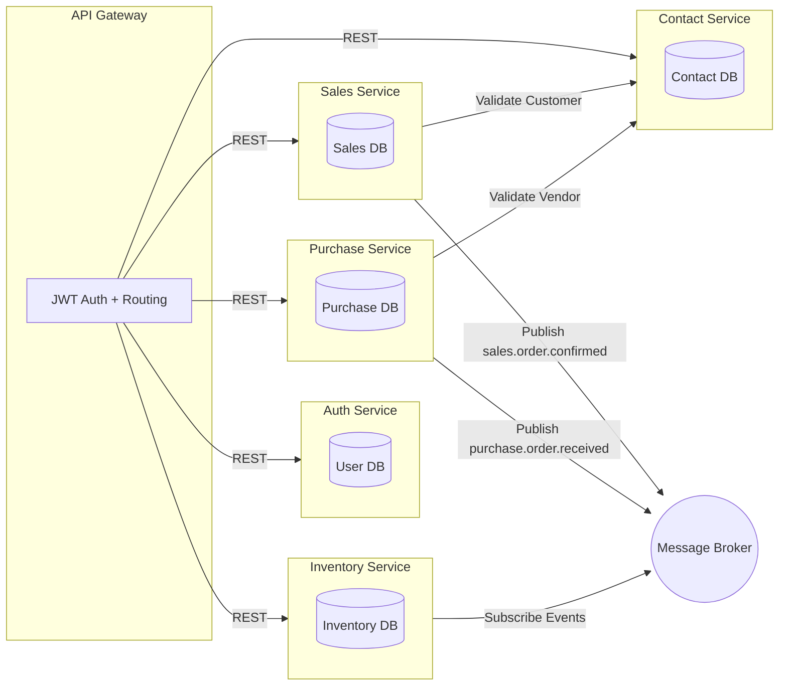

# 🧩 Microservice Coding Challenge (Golang)

Welcome to the **Microservice Coding Challenge**!

This challenge tests your ability to design and implement a **scalable, secure, and modular backend system** using **Golang microservices**.  
It focuses on **architecture, service communication, and security design** — not UI or boilerplate CRUD.

---

## 🎯 Objective

Build a small, microservice ecosystem that represents a subset of a bigger system:

1. **Contacts Service** → manages Customers & Vendors
2. **Inventory Service** → manages Items & Stock
3. **Sales Service** → manages Customer Sales Orders
4. **Purchase Service** → manages Vendor Purchase Orders
5. **Auth Service** → handles Authentication & Authorization
6. **API Gateway** → routes and secures requests between clients and internal services

You are expected to demonstrate:
1. Sound architectural design choices
2. Service isolation and inter-service communication
3. Proper security and RBAC
4. Working deployment using Docker

---

## 🧠 Functional Overview

### **1. Contact Service**
1. Manage `Customer` and `Vendor` entities (CRUD)
2. Expose REST API: `/customers`, `/vendors`
3. Emit events on `created` or `updated` actions

### **2. Inventory Service**
1. Manage `Item` and `Stock`
2. Subscribe to events from:
   - Sales Service (`sales.order.confirmed`) → Decrease stock
   - Purchase Service (`purchase.order.received`) → Increase stock

### **3. Sales Service**
1. Manage Sales Orders linked to Customers
2. Confirming an order emits `sales.order.confirmed` event
3. Status: `Draft`, `Confirmed`, `Paid`

### **4. Purchase Service**
1. Manage Purchase Orders linked to Vendors
2. Receiving an order emits `purchase.order.received` event
3. Status: `Draft`, `Received`, `Paid`

### **5. Auth Service**
1. JWT-based Authentication and Authorization
2. Support at least two roles:
   - `inventory_manager`
   - `finance_manager`
3. Validate JWTs issued to users and inter-service tokens

### **6. API Gateway**
1. Routes requests to microservices
2. Validates JWTs

---

## 🧱 Architecture Requirements

Each service must:
1. Run independently (own Docker container)
2. Have its own database (Postgres or SQLite)
3. Use REST APIs for synchronous communication
4. Use a message broker (RabbitMQ, NATS, or in-memory pub/sub, or your choice of technology) for async communication, for interservice communication
5. Implement role-based authorization on key endpoints
6. Be documented with OpenAPI/Swagger


## ⚙️ Recomended Project Structure Example / Flexible according to your preference.
```bash
microservice-challenge/
├── services/
│   ├── auth/          # Handles authentication and JWT-based authorization
│   ├── contact/       # Manages customer and supplier contact information
│   ├── inventory/     # Tracks stock items, adjustments, and availability
│   ├── sales/         # Handles sales orders and related workflows
│   └── purchase/      # Manages purchase requests and supplier orders
├── gateway/           # API gateway for routing and aggregation
├── docker-compose.yml # Container orchestration for local setup
└── README.md          # Documentation and setup guide
```
---

## 🔁 Inter-Service Communication

1. **Sync Call Example:**  
   Sales Service → Contact Service (GET `/customers/{id}`) to validate customer.

2. **Async Event Example:**  
   Sales Service publishes `sales.order.confirmed` → Inventory Service subscribes → decreases item stock.

---

## 🧠 Architecture Diagram (Mermaid)


---


## 3️⃣ Example Flow

1. Create a Vendor via Contact Service
2. Create a Purchase Order → triggers event → Inventory stock increases
3. Create a Customer via Contact Service
4. Create a Sales Order → triggers event → Inventory stock decreases

## 📦 Submission Instructions

Push your complete solution to this GitHub repository

Include:
1. Source code
2. Architecture diagram
3. Setup guide
4. Example API usage (with sample curl or Postman)

Add your name and contact in the README header

## Good luck! 🚀
Use this challenge to show how you approach real-world backend problems — not just syntax, but architecture, communication, and design thinking.