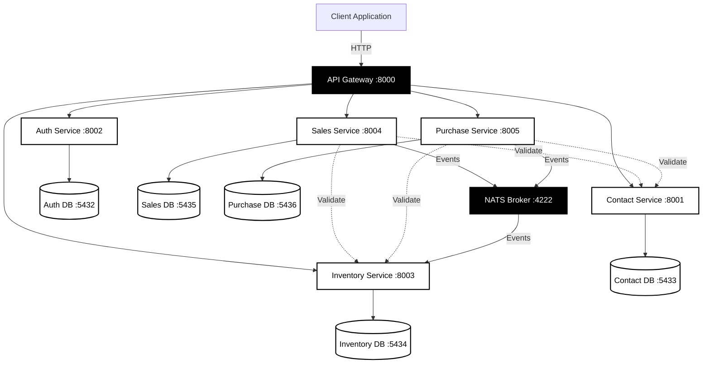

# Microservice Coding Challenge - Submission

**Developer:** Azmeraw Tefera  
**Contact:** +251 928 164 045  
**Email:** azmetefera07@gmail.com

---

## Table of Contents

1. [Project Overview](#project-overview)
2. [Architecture](#architecture)
3. [Setup Guide](#setup-guide)
4. [API Usage Examples](#api-usage-examples)
5. [Service Descriptions](#service-descriptions)
6. [Swagger Documentation](#swagger-documentation)
7. [Deployment](#deployment)
8. [Architecture & Implementation Details](#architecture--implementation-details)

---

## Quick Reference

**Base URL:** `http://localhost:8000`  
**API Gateway:** `http://localhost:8000`  
**Swagger UI:** `http://localhost:8000/swagger/index.html`

**Quick Start:**
```bash
# 1. Clone repository
git clone <repository-url>
cd SR-BE-interview-1

# 2. Configure environment
cp .env.example .env
# Edit .env with your values

# 3. Start services
docker compose up --build -d

# 4. Run migrations
./scripts/run_migrations.sh

# 5. Verify
curl http://localhost:8000/health
```

**Service Ports:**
- Gateway: 8000
- Auth: 8002
- Contact: 8001
- Inventory: 8003
- Sales: 8004
- Purchase: 8005

---

## Project Overview

This project implements a complete microservices ecosystem using Golang with the following services:

1. **Auth Service** - JWT-based authentication and authorization
2. **Contact Service** - Customer and Vendor management
3. **Inventory Service** - Item and Stock management with event-driven updates
4. **Sales Service** - Sales order management
5. **Purchase Service** - Purchase order management
6. **API Gateway** - Request routing and JWT validation

### Key Features

1. **Type-Safe Database Operations** - Using `sqlc` for all database queries
2. **Event-Driven Architecture** - NATS message broker for async communication
3. **Role-Based Access Control** - JWT-based authentication with RBAC
4. **Comprehensive API Documentation** - Swagger/OpenAPI for all services
5. **Docker Containerization** - All services containerized and orchestrated
6. **Database Per Service** - Service isolation with independent databases
7. **Transaction Management** - Proper database transactions for atomic operations
8. **Parallel Processing** - Efficient concurrent operations for order validation  

---

## Architecture

### System Architecture Diagram



### Architecture Flow Explanation

1. **Client Request Flow:**
   - All client requests enter through the API Gateway (port 8000)
   - Gateway validates JWT tokens for protected endpoints
   - Gateway routes requests to appropriate microservices

2. **Service Communication:**
   - **Synchronous:** Services communicate via REST API calls (dashed lines)
   - **Asynchronous:** Services publish events to NATS for decoupled updates (solid lines)

3. **Data Isolation:**
   - Each service has its own PostgreSQL database
   - Complete data isolation ensures service independence

4. **Event-Driven Stock Updates:**
   - Sales Service publishes `sales.order.confirmed` event
   - Purchase Service publishes `purchase.order.received` event
   - Inventory Service subscribes to these events and updates stock automatically

### Architecture Principles

1. **Service Isolation** - Each service has its own database and runs independently
2. **Synchronous Communication** - REST APIs for service-to-service calls
3. **Asynchronous Communication** - NATS message broker for event-driven updates
4. **API Gateway Pattern** - Single entry point with JWT validation
5. **Database Per Service** - Complete data isolation
6. **Event-Driven Updates** - Stock updates via NATS events

### Technology Stack

1. **Language:** Go 1.25
2. **Database:** PostgreSQL 16.10
3. **Message Broker:** NATS
4. **HTTP Router:** Chi
5. **SQL Code Generation:** sqlc
6. **API Documentation:** Swagger/OpenAPI
7. **Containerization:** Docker & Docker Compose
8. **Authentication:** JWT (golang-jwt/jwt/v5)
9. **Password Hashing:** bcrypt

---

## Setup Guide

### Prerequisites

Before starting, ensure you have the following installed:

1. **Docker** (version 20.10 or higher)
2. **Docker Compose** (version 2.0 or higher)
3. **Git** (for cloning the repository)

Optional tools (for development):
- Go 1.25+ (for local development)
- `sqlc` CLI (SQL queries are pre-generated, not required)
- `swag` CLI (Swagger documentation is pre-generated, not required)

### Step-by-Step Setup Instructions

Follow these steps in order to set up and run the microservices system:

#### Step 1: Clone the Repository

```bash
git clone <repository-url>
cd SR-BE-interview-1
```

#### Step 2: Configure Environment Variables

Create the environment file from the example:

```bash
cp .env.example .env
```

Edit the `.env` file and set the following required variables:

```bash
# Database Configuration
DB_USER=microservice
DB_PASSWORD=your_secure_password_here

# JWT Configuration
JWT_SECRET=your_jwt_secret_key_here_minimum_32_characters

# Service-to-Service Authentication
SERVICE_SECRET=your_service_secret_key_here
```

**Important:** Replace placeholder values with secure, random strings. Minimum 32 characters recommended for secrets.

#### Step 3: Start All Services

Build and start all Docker containers:

```bash
docker compose up --build -d
```

This command will:
- Build Docker images for all services
- Start all containers in detached mode
- Set up all databases
- Start NATS message broker

Wait approximately 30-60 seconds for all services to initialize.

#### Step 4: Run Database Migrations

Execute database migrations to create all required tables:

```bash
./scripts/run_migrations.sh
```

This script will:
- Connect to each service database
- Run all migration files
- Create all required tables and indexes
- Verify migration success

#### Step 5: Verify Services Are Running

Check the status of all containers:

```bash
docker compose ps
```

Expected output: All services should show status "Up" and health "healthy" (if health checks are configured).

#### Step 6: Test Service Health

Verify the API Gateway is responding:

```bash
curl http://localhost:8000/health
```

Expected response:
```json
{"status":"ok","message":"Gateway is healthy"}
```

### Verification Checklist

After setup, verify the following:

- [ ] All Docker containers are running (`docker compose ps`)
- [ ] API Gateway responds to health check (`curl http://localhost:8000/health`)
- [ ] Swagger UI is accessible (http://localhost:8000/swagger/index.html)
- [ ] All databases are accessible (check logs: `docker compose logs db-auth`)
- [ ] NATS broker is running (check logs: `docker compose logs nats`)

### Service Ports

| Service | Port | Swagger UI |
|---------|------|------------|
| API Gateway | 8000 | http://localhost:8000/swagger/index.html |
| Contact Service | 8001 | http://localhost:8001/swagger/index.html |
| Auth Service | 8002 | http://localhost:8002/swagger/index.html |
| Inventory Service | 8003 | http://localhost:8003/swagger/index.html |
| Sales Service | 8004 | http://localhost:8004/swagger/index.html |
| Purchase Service | 8005 | http://localhost:8005/swagger/index.html |
| NATS | 4222 | - |
| PostgreSQL (Auth) | 5432 | - |
| PostgreSQL (Contact) | 5433 | - |
| PostgreSQL (Inventory) | 5434 | - |
| PostgreSQL (Sales) | 5435 | - |
| PostgreSQL (Purchase) | 5436 | - |

### Environment Variables

Required environment variables (set in `.env` file):

```bash
# Database
DB_USER=microservice
DB_PASSWORD=your_secure_password

# JWT
JWT_SECRET=your_jwt_secret_key_min_32_chars
JWT_USER_EXPIRATION_HOURS=24

# Service Authentication
SERVICE_SECRET=your_service_secret_key

# NATS
NATS_URL=nats://nats:4222

# Service URLs (for Docker)
AUTH_SERVICE_URL=http://auth:8000
CONTACT_SERVICE_URL=http://contact:8000
INVENTORY_SERVICE_URL=http://inventory:8000
SALES_SERVICE_URL=http://sales:8000
PURCHASE_SERVICE_URL=http://purchase:8000
```

### Troubleshooting Common Issues

#### Issue: Services fail to start

**Solution:**
1. Check Docker is running: `docker ps`
2. Check port availability: Ensure ports 8000-8005, 4222, 5432-5436 are not in use
3. Check logs: `docker compose logs [service-name]`
4. Verify `.env` file exists and contains all required variables

#### Issue: Database connection errors

**Solution:**
1. Verify database containers are running: `docker compose ps | grep db-`
2. Check database logs: `docker compose logs db-auth`
3. Ensure DB_PASSWORD in `.env` matches database configuration
4. Wait 30-60 seconds after starting services for databases to initialize

#### Issue: Migration script fails

**Solution:**
1. Ensure all services are running: `docker compose ps`
2. Verify database containers are healthy
3. Check database connection strings in migration script
4. Run migrations individually if needed: `docker exec -it db-auth psql -U microservice -d auth_db -f /migrations/001_init.sql`

#### Issue: Gateway returns 502 Bad Gateway

**Solution:**
1. Verify target service is running: `docker compose ps`
2. Check service logs: `docker compose logs [service-name]`
3. Verify service URLs in gateway `.env` file match Docker service names
4. Restart gateway: `docker compose restart gateway`

#### Issue: Cannot access Swagger UI

**Solution:**
1. Verify service is running: `docker compose ps`
2. Check service port is accessible: `curl http://localhost:8000/health`
3. Ensure Swagger docs are generated (they should be pre-generated)
4. Check browser console for errors

#### Issue: Authentication token not working

**Solution:**
1. Verify JWT_SECRET in `.env` matches across all services
2. Check token expiration (default: 24 hours)
3. Ensure token format: `Bearer <token>` in Authorization header
4. Re-login to get a new token

### Stopping Services

To stop all services:

```bash
docker compose down
```

To stop and remove all data (clean slate):

```bash
docker compose down -v
```

**Warning:** Using `-v` flag will delete all database volumes and data.

### Viewing Logs

View logs for all services:

```bash
docker compose logs -f
```

View logs for a specific service:

```bash
docker compose logs -f auth
docker compose logs -f contact
docker compose logs -f inventory
docker compose logs -f sales
docker compose logs -f purchase
docker compose logs -f gateway
docker compose logs -f nats
```

### Restarting Services

Restart a specific service:

```bash
docker compose restart [service-name]
```

Restart all services:

```bash
docker compose restart
```

---

## API Usage Examples

### Base URL

All examples use the API Gateway at: `http://localhost:8000`

### Authentication Flow

#### 1. Register a New User

```bash
curl -X POST http://localhost:8000/api/auth/register \
  -H 'Content-Type: application/json' \
  -d '{
    "email": "finance@example.com",
    "password": "securepassword123",
    "role": "finance_manager"
  }'
```

**Response (201 Created):**
```json
{
  "status": 201,
  "message": "User registered successfully",
  "data": {
    "id": "550e8400-e29b-41d4-a716-446655440000",
    "email": "finance@example.com",
    "role": "finance_manager",
    "created_at": "2025-11-20T12:00:00Z",
    "updated_at": "2025-11-20T12:00:00Z"
  }
}
```

#### 2. Login

```bash
curl -X POST http://localhost:8000/api/auth/login \
  -H 'Content-Type: application/json' \
  -d '{
    "email": "finance@example.com",
    "password": "securepassword123"
  }'
```

**Response (200 OK):**
```json
{
  "status": 200,
  "message": "Login successful",
  "data": {
    "access_token": "eyJhbGciOiJIUzI1NiIsInR5cCI6IkpXVCJ9...",
    "token_type": "Bearer",
    "expires_in": 86400
  }
}
```

**Save the token for subsequent requests:**
```bash
export TOKEN="eyJhbGciOiJIUzI1NiIsInR5cCI6IkpXVCJ9..."
```

### Contact Service Examples

#### 3. Create a Customer

```bash
curl -X POST http://localhost:8000/api/customers \
  -H 'Content-Type: application/json' \
  -H "Authorization: Bearer $TOKEN" \
  -d '{
    "name": "John Doe",
    "email": "john.doe@example.com",
    "phone": "+251912345678",
    "address": "123 Main Street, Addis Ababa"
  }'
```

**Response (201 Created):**
```json
{
  "status": 201,
  "message": "Customer created successfully",
  "data": {
    "id": "123e4567-e89b-12d3-a456-426614174000",
    "name": "John Doe",
    "email": "john.doe@example.com",
    "phone": "+251912345678",
    "address": "123 Main Street, Addis Ababa",
    "created_at": "2025-11-20T12:00:00Z",
    "updated_at": "2025-11-20T12:00:00Z"
  }
}
```

#### 4. Create a Vendor

```bash
curl -X POST http://localhost:8000/api/vendors \
  -H 'Content-Type: application/json' \
  -H "Authorization: Bearer $TOKEN" \
  -d '{
    "name": "ABC Suppliers",
    "email": "contact@abcsuppliers.com",
    "phone": "+251955555555",
    "address": "456 Business Avenue, Addis Ababa"
  }'
```

#### 5. List Customers

```bash
curl -X GET "http://localhost:8000/api/customers?limit=10&offset=0" \
  -H "Authorization: Bearer $TOKEN"
```

#### 6. Get Customer by ID

```bash
curl -X GET http://localhost:8000/api/customers/{customer_id} \
  -H "Authorization: Bearer $TOKEN"
```

### Inventory Service Examples

#### 7. Create an Item

```bash
curl -X POST http://localhost:8000/api/items \
  -H 'Content-Type: application/json' \
  -H "Authorization: Bearer $TOKEN" \
  -d '{
    "name": "Laptop Computer",
    "description": "High-performance laptop",
    "sku": "LAPTOP-001",
    "unit_price": 45000.00
  }'
```

**Response (201 Created):**
```json
{
  "status": 201,
  "message": "Item created successfully",
  "data": {
    "id": "789e4567-e89b-12d3-a456-426614174000",
    "name": "Laptop Computer",
    "description": "High-performance laptop",
    "sku": "LAPTOP-001",
    "unit_price": 45000.00,
    "created_at": "2025-11-20T12:00:00Z",
    "updated_at": "2025-11-20T12:00:00Z"
  }
}
```

#### 8. Get Stock for an Item

```bash
curl -X GET http://localhost:8000/api/items/{item_id}/stock \
  -H "Authorization: Bearer $TOKEN"
```

#### 9. Adjust Stock

```bash
curl -X PUT http://localhost:8000/api/items/{item_id}/stock \
  -H 'Content-Type: application/json' \
  -H "Authorization: Bearer $TOKEN" \
  -d '{
    "quantity": 50
  }'
```

### Sales Service Examples

#### 10. Create a Sales Order

```bash
curl -X POST http://localhost:8000/api/sales/orders \
  -H 'Content-Type: application/json' \
  -H "Authorization: Bearer $TOKEN" \
  -d '{
    "customer_id": "123e4567-e89b-12d3-a456-426614174000",
    "items": [
      {
        "item_id": "789e4567-e89b-12d3-a456-426614174000",
        "quantity": 2,
        "unit_price": 45000.00
      }
    ]
  }'
```

**Response (201 Created):**
```json
{
  "status": 201,
  "message": "Sales order created successfully",
  "data": {
    "order": {
      "id": "order-uuid-here",
      "customer_id": "123e4567-e89b-12d3-a456-426614174000",
      "status": "draft",
      "total_amount": 90000.00,
      "created_at": "2025-11-20T12:00:00Z",
      "updated_at": "2025-11-20T12:00:00Z"
    },
    "items": [
      {
        "id": "item-uuid-here",
        "order_id": "order-uuid-here",
        "item_id": "789e4567-e89b-12d3-a456-426614174000",
        "quantity": 2,
        "unit_price": 45000.00,
        "subtotal": 90000.00
      }
    ]
  }
}
```

#### 11. Confirm a Sales Order

```bash
curl -X POST http://localhost:8000/api/sales/orders/{order_id}/confirm \
  -H "Authorization: Bearer $TOKEN"
```

**This triggers:**
1. Order status changes from `draft` → `confirmed`
2. NATS event `sales.order.confirmed` is published
3. Inventory service receives event and decreases stock

#### 12. Pay a Sales Order

```bash
curl -X POST http://localhost:8000/api/sales/orders/{order_id}/pay \
  -H "Authorization: Bearer $TOKEN"
```

**Order status changes:** `confirmed` → `paid`

### Purchase Service Examples

#### 13. Create a Purchase Order

```bash
curl -X POST http://localhost:8000/api/purchase/orders \
  -H 'Content-Type: application/json' \
  -H "Authorization: Bearer $TOKEN" \
  -d '{
    "vendor_id": "vendor-uuid-here",
    "items": [
      {
        "item_id": "789e4567-e89b-12d3-a456-426614174000",
        "quantity": 10,
        "unit_price": 40000.00
      }
    ]
  }'
```

#### 14. Receive a Purchase Order

```bash
curl -X POST http://localhost:8000/api/purchase/orders/{order_id}/receive \
  -H "Authorization: Bearer $TOKEN"
```

**This triggers:**
1. Order status changes from `draft` → `received`
2. NATS event `purchase.order.received` is published
3. Inventory service receives event and increases stock

#### 15. Pay a Purchase Order

```bash
curl -X POST http://localhost:8000/api/purchase/orders/{order_id}/pay \
  -H "Authorization: Bearer $TOKEN"
```

**Order status changes:** `received` → `paid`

---

## 🔧 Service Descriptions

### Auth Service

**Port:** 8002  
**Database:** PostgreSQL (auth)

**Endpoints:**
1. `POST /register` - Register new user
2. `POST /login` - User authentication
3. `POST /forgot-password` - Request password reset
4. `POST /reset-password` - Reset password with token
5. `POST /service-token` - Generate inter-service token

**Roles:**
1. `inventory_manager` - Can manage inventory and orders
2. `finance_manager` - Full access including delete operations

**Features:**
1. JWT token generation
2. Password hashing with bcrypt
3. Role-based access control
4. Service token for inter-service communication

### Contact Service

**Port:** 8001  
**Database:** PostgreSQL (contact)

**Endpoints:**
1. `GET /customers` - List customers (paginated)
2. `GET /customers/{id}` - Get customer by ID
3. `POST /customers` - Create customer
4. `PUT /customers/{id}` - Update customer
5. `DELETE /customers/{id}` - Delete customer
6. `GET /vendors` - List vendors (paginated)
7. `GET /vendors/{id}` - Get vendor by ID
8. `POST /vendors` - Create vendor
9. `PUT /vendors/{id}` - Update vendor
10. `DELETE /vendors/{id}` - Delete vendor

**Events Published:**
1. `contact.customer.created`
2. `contact.customer.updated`
3. `contact.vendor.created`
4. `contact.vendor.updated`

### Inventory Service

**Port:** 8003  
**Database:** PostgreSQL (inventory)

**Endpoints:**
1. `GET /items` - List items (paginated)
2. `GET /items/{id}` - Get item by ID
3. `POST /items` - Create item
4. `PUT /items/{id}` - Update item
5. `DELETE /items/{id}` - Delete item (finance_manager only)
6. `GET /items/{item_id}/stock` - Get stock for item
7. `PUT /items/{item_id}/stock` - Adjust stock

**Events Subscribed:**
1. `sales.order.confirmed` → Decreases stock
2. `purchase.order.received` → Increases stock

**Features:**
1. Transaction-based stock adjustments
2. SKU normalization (uppercase)
3. Duplicate SKU prevention

### Sales Service

**Port:** 8004  
**Database:** PostgreSQL (sales)

**Endpoints:**
1. `GET /orders` - List sales orders (paginated)
2. `GET /orders/{id}` - Get order by ID
3. `POST /orders` - Create sales order
4. `PUT /orders/{id}` - Update order
5. `POST /orders/{id}/confirm` - Confirm order
6. `POST /orders/{id}/pay` - Pay order

**Order Status Flow:**
```
draft → confirmed → paid
```

**Events Published:**
1. `sales.order.confirmed` - When order is confirmed

**Features:**
1. Validates customer exists (via Contact Service)
2. Validates items exist (via Inventory Service)
3. Parallel item validation for performance
4. Calculates total amount automatically

### Purchase Service

**Port:** 8005  
**Database:** PostgreSQL (purchase)

**Endpoints:**
1. `GET /orders` - List purchase orders (paginated)
2. `GET /orders/{id}` - Get order by ID
3. `POST /orders` - Create purchase order
4. `PUT /orders/{id}` - Update order
5. `POST /orders/{id}/receive` - Receive order
6. `POST /orders/{id}/pay` - Pay order

**Order Status Flow:**
```
draft → received → paid
```

**Events Published:**
1. `purchase.order.received` - When order is received

**Features:**
1. Validates vendor exists (via Contact Service)
2. Validates items exist (via Inventory Service)
3. Parallel item validation for performance
4. Calculates total amount automatically

### API Gateway

**Port:** 8000

**Features:**
1. Request routing to appropriate services
2. JWT token validation
3. CORS support
4. Health check endpoint
5. Swagger UI integration

**Routes:**
1. `/api/auth/*` - Auth endpoints
2. `/api/customers/*` - Customer endpoints
3. `/api/vendors/*` - Vendor endpoints
4. `/api/items/*` - Item endpoints
5. `/api/sales/orders/*` - Sales order endpoints
6. `/api/purchase/orders/*` - Purchase order endpoints
7. `/health` - Health check
8. `/swagger/index.html` - Swagger UI

---

---

## Swagger Documentation

### Swagger Documentation

Swagger documentation is generated and included in the repository. Documentation files are committed to enable Swagger UI access after cloning and starting services.

### Swagger UI Access

Once services are running, access Swagger UI at:

| Service | Swagger URL |
|---------|-------------|
| **API Gateway** | http://localhost:8000/swagger/index.html |
| **Auth Service** | http://localhost:8002/swagger/index.html |
| **Contact Service** | http://localhost:8001/swagger/index.html |
| **Inventory Service** | http://localhost:8003/swagger/index.html |
| **Sales Service** | http://localhost:8004/swagger/index.html |
| **Purchase Service** | http://localhost:8005/swagger/index.html |

### Swagger Features

1. **Complete API Documentation** - All endpoints documented with descriptions
2. **Request/Response Examples** - Examples included in DTOs
3. **Try It Out** - Test endpoints directly from Swagger UI
4. **Authentication Support** - Bearer token authentication
5. **Schema Definitions** - Complete data models with examples
6. **Error Responses** - All error scenarios documented

### Using Authentication in Swagger UI

To use authenticated endpoints in Swagger UI:

1. Click the "Authorize" button at the top of the Swagger UI
2. Enter your JWT token: `Bearer <your-token>`
   - Obtain token by calling `/api/auth/login` endpoint
3. Click "Authorize"
4. Protected endpoints will use this token automatically

### Regenerating Swagger Docs (Optional)

If you modify Swagger annotations in the code and need to regenerate the docs:

#### Option 1: Use the Script

```bash
./generate_swagger.sh
```

This script regenerates Swagger docs for all services.

#### Option 2: Manual Regeneration

For each service individually:

```bash
# Auth Service
cd services/auth
swag init -g cmd/main.go --parseDependency --parseInternal

# Contact Service
cd services/contact
swag init -g cmd/main.go --parseDependency --parseInternal

# Inventory Service
cd services/inventory
swag init -g cmd/main.go --parseDependency --parseInternal

# Sales Service
cd services/sales
swag init -g cmd/main.go --parseDependency --parseInternal

# Purchase Service
cd services/purchase
swag init -g cmd/main.go --parseDependency --parseInternal
```

### Swagger Annotations

Swagger annotations are added to:

1. **Main files** (`cmd/main.go`): API metadata
   ```go
   // @title           Service API
   // @version         1.0
   // @description     Service description
   // @host            localhost:8000
   // @BasePath        /
   ```

2. **Handler functions** (`httphandler/httphandler.go`): Endpoint documentation
   ```go
   // @Summary      Endpoint summary
   // @Description  Detailed description
   // @Tags         tag-name
   // @Accept       json
   // @Produce      json
   // @Param        request body Model true "Request description"
   // @Success      200 {object} response.SuccessResponse{data=Model}
   // @Failure      400 {object} response.ValidationErrorResponse
   // @Router       /endpoint [post]
   ```

3. **Model structs** (`model/*.go`): Field examples
   ```go
   type Model struct {
       Field string `json:"field" example:"example-value"`
   }
   ```

### Files Included

Each service has a `docs/` folder with:

1. `docs.go` - Generated Go code for Swagger integration
2. `swagger.json` - JSON format documentation
3. `swagger.yaml` - YAML format documentation

These files are included in the repository.

---

## Deployment

### Docker Compose

The entire system is containerized using Docker Compose:

```bash
# Start all services
docker compose up -d

# Stop all services
docker compose down

# Rebuild and start
docker compose up --build -d

# View logs
docker compose logs -f

# Check status
docker compose ps
```

### Service Containers

1. `gateway` - API Gateway
2. `auth` - Auth Service
3. `contact` - Contact Service
4. `inventory` - Inventory Service
5. `sales` - Sales Service
6. `purchase` - Purchase Service
7. `nats` - NATS Message Broker
8. `db-auth` - Auth Database
9. `db-contact` - Contact Database
10. `db-inventory` - Inventory Database
11. `db-sales` - Sales Database
12. `db-purchase` - Purchase Database

### Database Migrations

Database migrations must be run after starting services for the first time.

Run migrations using the provided script:

```bash
./scripts/run_migrations.sh
```

**What this script does:**
1. Connects to each service database (auth, contact, inventory, sales, purchase)
2. Executes all migration files in order
3. Creates all required tables, indexes, and constraints
4. Verifies migration success

**Important:** Migrations only need to be run once after initial setup. Subsequent restarts do not require re-running migrations unless database volumes are removed.

---

## Example Complete Flow

### Scenario: Purchase and Sales Order Flow

1. **Create Vendor:**
```bash
curl -X POST http://localhost:8000/api/vendors \
  -H 'Content-Type: application/json' \
  -H "Authorization: Bearer $TOKEN" \
  -d '{"name":"Supplier Co","email":"supplier@example.com","phone":"+251955555555","address":"Supplier Address"}'
# Save vendor_id
```

2. **Create Customer:**
```bash
curl -X POST http://localhost:8000/api/customers \
  -H 'Content-Type: application/json' \
  -H "Authorization: Bearer $TOKEN" \
  -d '{"name":"Customer Co","email":"customer@example.com","phone":"+251912345678","address":"Customer Address"}'
# Save customer_id
```

3. **Create Item:**
```bash
curl -X POST http://localhost:8000/api/items \
  -H 'Content-Type: application/json' \
  -H "Authorization: Bearer $TOKEN" \
  -d '{"name":"Product A","description":"Test Product","sku":"PROD-001","unit_price":1000.00}'
# Save item_id
```

4. **Create Purchase Order:**
```bash
curl -X POST http://localhost:8000/api/purchase/orders \
  -H 'Content-Type: application/json' \
  -H "Authorization: Bearer $TOKEN" \
  -d '{
    "vendor_id":"vendor_id_from_step_1",
    "items":[{"item_id":"item_id_from_step_3","quantity":50,"unit_price":1000.00}]
  }'
# Save order_id
```

5. **Receive Purchase Order (Stock Increases):**
```bash
curl -X POST http://localhost:8000/api/purchase/orders/{order_id}/receive \
  -H "Authorization: Bearer $TOKEN"
# This publishes purchase.order.received event
# Inventory service automatically increases stock by 50
```

6. **Verify Stock Increased:**
```bash
curl -X GET http://localhost:8000/api/items/{item_id}/stock \
  -H "Authorization: Bearer $TOKEN"
# Should show quantity: 50
```

7. **Create Sales Order:**
```bash
curl -X POST http://localhost:8000/api/sales/orders \
  -H 'Content-Type: application/json' \
  -H "Authorization: Bearer $TOKEN" \
  -d '{
    "customer_id":"customer_id_from_step_2",
    "items":[{"item_id":"item_id_from_step_3","quantity":20,"unit_price":1200.00}]
  }'
# Save order_id
```

8. **Confirm Sales Order (Stock Decreases):**
```bash
curl -X POST http://localhost:8000/api/sales/orders/{order_id}/confirm \
  -H "Authorization: Bearer $TOKEN"
# This publishes sales.order.confirmed event
# Inventory service automatically decreases stock by 20
```

9. **Verify Stock Decreased:**
```bash
curl -X GET http://localhost:8000/api/items/{item_id}/stock \
  -H "Authorization: Bearer $TOKEN"
# Should show quantity: 30 (50 - 20)
```
