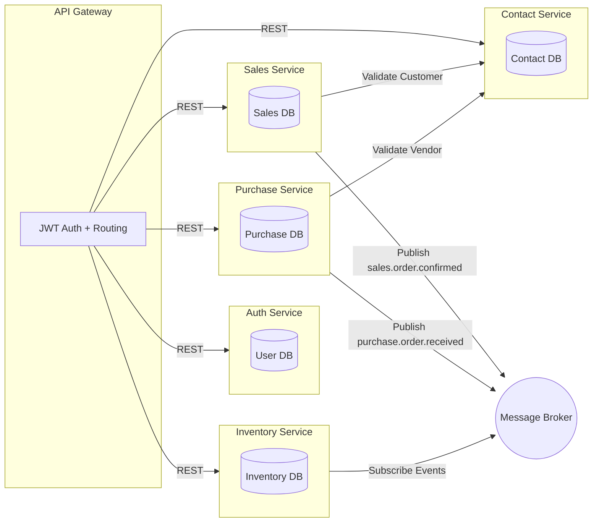

# 🧩 Microservice Coding Challenge (Golang)

**Author:** Azmeraw Tefera  
**Contact:** azmetefera07@gmail.com

Welcome to the **Microservice Coding Challenge**!

This challenge tests your ability to design and implement a **scalable, secure, and modular backend system** using **Golang microservices**.  
It focuses on **architecture, service communication, and security design** — not UI or boilerplate CRUD.

---

## 🎯 Objective

Build a small, microservice ecosystem that represents a subset of a bigger system:

- **Contacts Service** → manages Customers & Vendors  
- **Inventory Service** → manages Items & Stock  
- **Sales Service** → manages Customer Sales Orders  
- **Purchase Service** → manages Vendor Purchase Orders  
- **Auth Service** → handles Authentication & Authorization  
- **API Gateway** → routes and secures requests between clients and internal services  

You are expected to demonstrate:
- Sound architectural design choices
- Service isolation and inter-service communication
- Proper security and RBAC
- Working deployment using Docker

---

## 🧠 Functional Overview

### **1. Contact Service**
- Manage `Customer` and `Vendor` entities (CRUD)
- Expose REST API: `/customers`, `/vendors`
- Emit events on `created` or `updated` actions

### **2. Inventory Service**
- Manage `Item` and `Stock`
- Subscribe to events from:
  - Sales Service (`sales.order.confirmed`) → Decrease stock
  - Purchase Service (`purchase.order.received`) → Increase stock

### **3. Sales Service**
- Manage Sales Orders linked to Customers
- Confirming an order emits `sales.order.confirmed` event
- Status: `Draft`, `Confirmed`, `Paid`

### **4. Purchase Service**
- Manage Purchase Orders linked to Vendors
- Receiving an order emits `purchase.order.received` event
- Status: `Draft`, `Received`, `Paid`

### **5. Auth Service**
- JWT-based Authentication and Authorization
- Support at least two roles:
  - `inventory_manager`
  - `finance_manager`
- Validate JWTs issued to users and inter-service tokens

### **6. API Gateway**
- Routes requests to microservices
- Validates JWTs

---

## 🧱 Architecture Requirements

Each service must:
- Run independently (own Docker container)
- Have its own database (Postgres or SQLite)
- Use REST APIs for synchronous communication
- Use a message broker (RabbitMQ, NATS, or in-memory pub/sub, or your choice of technology) for async communication, for interservice communication
- Implement role-based authorization on key endpoints
- Be documented with OpenAPI/Swagger


## ⚙️ Recomended Project Structure Example / Flexible according to your preference.
```bash
microservice-challenge/
├── services/
│   ├── auth/          # Handles authentication and JWT-based authorization
│   ├── contact/       # Manages customer and supplier contact information
│   ├── inventory/     # Tracks stock items, adjustments, and availability
│   ├── sales/         # Handles sales orders and related workflows
│   └── purchase/      # Manages purchase requests and supplier orders
├── gateway/           # API gateway for routing and aggregation
├── docker-compose.yml # Container orchestration for local setup
└── README.md          # Documentation and setup guide
```
---

## 🔁 Inter-Service Communication

- **Sync Call Example:**  
  Sales Service → Contact Service (GET `/customers/{id}`) to validate customer.

- **Async Event Example:**  
  Sales Service publishes `sales.order.confirmed` → Inventory Service subscribes → decreases item stock.

---

## 🧠 Architecture Diagram (Mermaid)


---


## 3️⃣ Example Flow

- Create a Vendor via Contact Service
- Create a Purchase Order → triggers event → Inventory stock increases
- Create a Customer via Contact Service
- Create a Sales Order → triggers event → Inventory stock decreases

---

## 🚀 Setup Guide

### Prerequisites

- Go 1.25 or higher
- Docker and Docker Compose
- PostgreSQL client (psql) - optional, for manual migrations
- Make (optional, for convenience commands)

### Quick Start

1. **Clone the repository**
   ```bash
   git clone <repository-url>
   cd SR-BE-interview-1
   ```

2. **Create environment file**
   ```bash
   cp .env.example .env
   # Edit .env with your configuration:
   # - DB_PASSWORD (required)
   # - JWT_SECRET (required)
   # - Service URLs (optional, defaults provided)
   ```

3. **Start all services using Docker Compose**
   ```bash
   docker compose up -d
   ```

   Or use the convenience script:
   ```bash
   bash start_all.sh
   ```

4. **Run database migrations**
   Migrations are automatically run by `start_all.sh`, or manually:
   ```bash
   PGPASSWORD=${DB_PASSWORD} psql -h localhost -p 5432 -U ${DB_USER} -d ${DB_NAME} \
     -f migrations/auth/000001_create_users_table.up.sql
   # Repeat for other services...
   ```

5. **Verify services are running**
   ```bash
   curl http://localhost:8000/health  # Gateway
   curl http://localhost:8002/health # Auth
   curl http://localhost:8001/health # Contact
   curl http://localhost:8003/health # Inventory
   curl http://localhost:8004/health # Sales
   curl http://localhost:8005/health # Purchase
   ```

### Service Ports

- **Gateway:** 8000
- **Auth Service:** 8002
- **Contact Service:** 8001
- **Inventory Service:** 8003
- **Sales Service:** 8004
- **Purchase Service:** 8005
- **NATS:** 4222 (client), 8222 (monitoring)

### Swagger Documentation

Access Swagger UI for each service:
- Auth: http://localhost:8002/swagger/index.html
- Contact: http://localhost:8001/swagger/index.html
- Inventory: http://localhost:8003/swagger/index.html
- Sales: http://localhost:8004/swagger/index.html
- Purchase: http://localhost:8005/swagger/index.html

### Stopping Services

```bash
bash stop_all.sh
```

Or using Docker Compose:
```bash
docker compose down
```

---

## 📝 Example API Usage

### 1. Authentication

**Register a new user:**
```bash
curl -X POST http://localhost:8000/api/auth/register \
  -H "Content-Type: application/json" \
  -d '{
    "email": "finance@example.com",
    "password": "password123",
    "role": "finance_manager"
  }'
```

**Login:**
```bash
curl -X POST http://localhost:8000/api/auth/login \
  -H "Content-Type: application/json" \
  -d '{
    "email": "finance@example.com",
    "password": "password123"
  }'
```

**Response:**
```json
{
  "status": 200,
  "message": "Login successful",
  "data": {
    "access_token": "eyJhbGciOiJIUzI1NiIsInR5cCI6IkpXVCJ9...",
    "token_type": "Bearer"
  }
}
```

Save the token for subsequent requests:
```bash
TOKEN="eyJhbGciOiJIUzI1NiIsInR5cCI6IkpXVCJ9..."
```

### 2. Contact Service

**Create a Customer:**
```bash
curl -X POST http://localhost:8000/api/customers \
  -H "Content-Type: application/json" \
  -H "Authorization: Bearer $TOKEN" \
  -d '{
    "name": "John Doe",
    "email": "john@example.com",
    "phone": "+1234567890",
    "address": "123 Main St"
  }'
```

**Create a Vendor:**
```bash
curl -X POST http://localhost:8000/api/vendors \
  -H "Content-Type: application/json" \
  -H "Authorization: Bearer $TOKEN" \
  -d '{
    "name": "ABC Suppliers",
    "email": "contact@abcsuppliers.com",
    "phone": "+1234567890",
    "address": "456 Vendor Ave"
  }'
```

**List Customers:**
```bash
curl -X GET "http://localhost:8000/api/customers?page=1&size=10" \
  -H "Authorization: Bearer $TOKEN"
```

### 3. Inventory Service

**Create an Item:**
```bash
curl -X POST http://localhost:8000/api/inventory/items \
  -H "Content-Type: application/json" \
  -H "Authorization: Bearer $TOKEN" \
  -d '{
    "name": "Product XYZ",
    "description": "A sample product",
    "sku": "PROD-XYZ-001",
    "unit_price": 99.99
  }'
```

**Adjust Stock:**
```bash
curl -X PUT http://localhost:8000/api/inventory/items/{item_id}/stock \
  -H "Content-Type: application/json" \
  -H "Authorization: Bearer $TOKEN" \
  -d '{
    "quantity": 100
  }'
```

### 4. Sales Service

**Create a Sales Order:**
```bash
curl -X POST http://localhost:8000/api/sales/orders \
  -H "Content-Type: application/json" \
  -H "Authorization: Bearer $TOKEN" \
  -d '{
    "customer_id": "customer-uuid-here",
    "items": [
      {
        "item_id": "item-uuid-here",
        "quantity": 5
      }
    ]
  }'
```

**Confirm Order (publishes NATS event):**
```bash
curl -X POST http://localhost:8000/api/sales/orders/{order_id}/confirm \
  -H "Authorization: Bearer $TOKEN"
```

**Pay Order:**
```bash
curl -X POST http://localhost:8000/api/sales/orders/{order_id}/pay \
  -H "Authorization: Bearer $TOKEN"
```

### 5. Purchase Service

**Create a Purchase Order:**
```bash
curl -X POST http://localhost:8000/api/purchase/orders \
  -H "Content-Type: application/json" \
  -H "Authorization: Bearer $TOKEN" \
  -d '{
    "vendor_id": "vendor-uuid-here",
    "items": [
      {
        "item_id": "item-uuid-here",
        "quantity": 20
      }
    ]
  }'
```

**Receive Order (publishes NATS event):**
```bash
curl -X POST http://localhost:8000/api/purchase/orders/{order_id}/receive \
  -H "Authorization: Bearer $TOKEN"
```

**Pay Order:**
```bash
curl -X POST http://localhost:8000/api/purchase/orders/{order_id}/pay \
  -H "Authorization: Bearer $TOKEN"
```

### Complete Example Flow

```bash
# 1. Register and login
TOKEN=$(curl -s -X POST http://localhost:8000/api/auth/login \
  -H "Content-Type: application/json" \
  -d '{"email":"finance@example.com","password":"password123"}' \
  | jq -r '.data.access_token')

# 2. Create a vendor
VENDOR_ID=$(curl -s -X POST http://localhost:8000/api/vendors \
  -H "Content-Type: application/json" \
  -H "Authorization: Bearer $TOKEN" \
  -d '{"name":"Test Vendor","email":"vendor@test.com","phone":"+1234567890"}' \
  | jq -r '.data.id')

# 3. Create an item
ITEM_ID=$(curl -s -X POST http://localhost:8000/api/inventory/items \
  -H "Content-Type: application/json" \
  -H "Authorization: Bearer $TOKEN" \
  -d '{"name":"Test Product","sku":"TEST-001","unit_price":49.99}' \
  | jq -r '.data.id')

# 4. Adjust stock
curl -X PUT http://localhost:8000/api/inventory/items/$ITEM_ID/stock \
  -H "Content-Type: application/json" \
  -H "Authorization: Bearer $TOKEN" \
  -d '{"quantity":100}'

# 5. Create purchase order
ORDER_ID=$(curl -s -X POST http://localhost:8000/api/purchase/orders \
  -H "Content-Type: application/json" \
  -H "Authorization: Bearer $TOKEN" \
  -d "{\"vendor_id\":\"$VENDOR_ID\",\"items\":[{\"item_id\":\"$ITEM_ID\",\"quantity\":20}]}" \
  | jq -r '.data.id')

# 6. Receive order (triggers stock increase via NATS)
curl -X POST http://localhost:8000/api/purchase/orders/$ORDER_ID/receive \
  -H "Authorization: Bearer $TOKEN"

# 7. Verify stock increased
curl http://localhost:8000/api/inventory/items/$ITEM_ID/stock \
  -H "Authorization: Bearer $TOKEN"
```

### Testing Scripts

End-to-end test scripts are available:
- `test_day5_endpoints.sh` - Tests Sales Service
- `test_day6_endpoints.sh` - Tests Purchase Service

Run tests:
```bash
bash test_day5_endpoints.sh
bash test_day6_endpoints.sh
```

---

## 📦 Submission Instructions

Push your complete solution to this GitHub repository

Include:
- Source code
- Architecture diagram
- Setup guide
- Example API usage (with sample curl or Postman)

Add your name and contact in the README header

## Good luck! 🚀
Use this challenge to show how you approach real-world backend problems — not just syntax, but architecture, communication, and design thinking.
