# 🏢 ERP Order Platform - Monorepo Microservices Architecture

> A production-ready, enterprise-grade monorepo microservices platform built with Go, implementing a complete ERP order management system with event-driven architecture, comprehensive authentication, and scalable service design.

[](https://golang.org/)
[](https://www.postgresql.org/)
[](https://www.docker.com/)
[](LICENSE)


---

## 📑 Table of Contents

1. [Project Overview](#project-overview)
2. [Monorepo Structure](#-monorepo-structure)
3. [Architecture](#architecture)
4. [Setup Guide](#setup-guide)
5. [API Usage Examples](#api-usage-examples)
6. [Service Descriptions](#service-descriptions)
7. [API Documentation](#api-documentation)
8. [Deployment](#-deployment)
9. [Complete Workflow Example](#-complete-workflow-example)

---

## ⚡ Quick Reference

**Base URL:** `http://localhost:8000`  
**API Gateway:** `http://localhost:8000`  
**Swagger UI:** `http://localhost:8000/swagger/index.html`

**Quick Start:**
```bash
# 1. Clone repository
git clone https://github.com/azme12/erp-order-platform-monorepo-microservices-.git
cd erp-order-platform-monorepo-microservices-

# 2. Configure environment
cp .env.example .env
# Edit .env with your configuration values

# 3. Start all services
docker compose up --build -d

# 4. Run database migrations
./scripts/run_migrations.sh

# 5. Verify system health
curl http://localhost:8000/health
```

**Service Ports:**
| Service | Port | Description |
|---------|------|-------------|
| Gateway | 8000 | API Gateway & Entry Point |
| Contact | 8001 | Customer & Vendor Management |
| Auth | 8002 | Authentication & Authorization |
| Inventory | 8003 | Inventory & Stock Management |
| Sales | 8004 | Sales Order Processing |
| Purchase | 8005 | Purchase Order Management |

---

## 📋 Project Overview

This enterprise-grade microservices platform demonstrates modern software architecture principles, implementing a complete ERP order management system. Built entirely in Go, the system showcases production-ready patterns including event-driven communication, service isolation, and comprehensive security measures.

### Why This Project?

This platform serves as a comprehensive demonstration of:
- **Microservices Architecture** - Proper service decomposition and independent deployment
- **Event-Driven Design** - Decoupled services communicating through domain events
- **Production Best Practices** - Type-safe code generation, comprehensive documentation, and containerization
- **Scalable System Design** - Database per service pattern enabling horizontal scaling
- **Security First** - JWT authentication, RBAC, and secure inter-service communication
- **Developer Experience** - Complete API documentation, easy setup, and clear architecture

### Core Services

The platform consists of six independently deployable microservices:

1. **🔐 Auth Service** - Enterprise-grade JWT-based authentication and authorization with role-based access control
2. **👥 Contact Service** - Comprehensive customer and vendor relationship management
3. **📦 Inventory Service** - Real-time inventory and stock management with event-driven synchronization
4. **💰 Sales Service** - Complete sales order lifecycle management with automated workflows
5. **🛒 Purchase Service** - Purchase order processing with vendor integration
6. **🚪 API Gateway** - Intelligent request routing, JWT validation, and centralized API management

### Key Features & Highlights

✨ **Type-Safe Database Layer** - Leveraging `sqlc` for compile-time SQL query validation and type safety  
🚀 **Event-Driven Architecture** - NATS message broker enabling decoupled, scalable service communication  
🔒 **Enterprise Security** - JWT-based authentication with role-based access control (RBAC)  
📚 **Comprehensive Documentation** - Auto-generated Swagger/OpenAPI documentation for all services  
🐳 **Production-Ready Deployment** - Fully containerized with Docker Compose for seamless orchestration  
🗄️ **Database Per Service** - Complete data isolation ensuring service independence and scalability  
⚡ **Transaction Management** - ACID-compliant database transactions for data integrity  
🔄 **Concurrent Processing** - Optimized parallel operations for high-performance order validation  
📊 **Real-Time Stock Updates** - Event-driven inventory synchronization across services  

---

## 📁 Monorepo Structure

This project follows a **monorepo architecture**, where all microservices, shared libraries, and infrastructure code are managed in a single repository. This approach provides significant advantages for development, code sharing, and deployment coordination.

### What is a Monorepo?

A **monorepo (monolithic repository)** is a single version control repository that contains multiple related projects or services. Unlike a multi-repo approach where each service has its own repository, a monorepo allows:

- **Shared Code Reuse** - Common packages and utilities are easily shared across services
- **Atomic Changes** - Update multiple services in a single commit
- **Consistent Tooling** - Unified build, test, and deployment processes
- **Easier Refactoring** - Cross-service refactoring is simpler
- **Better Developer Experience** - Single clone, unified dependencies

### Project Directory Structure

```
erp-order-platform-monorepo-microservices/
│
├── 📁 gateway/                    # API Gateway Service
│   ├── cmd/                      # Application entry point
│   ├── client/                   # Service clients
│   ├── router/                   # Request routing logic
│   └── Dockerfile               # Gateway container definition
│
├── 📁 services/                   # Microservices Directory
│   ├── auth/                     # Authentication Service
│   │   ├── cmd/                  # Service entry point
│   │   ├── httphandler/          # HTTP request handlers
│   │   ├── model/                # Domain models & validation
│   │   ├── queries/              # SQL queries (sqlc)
│   │   ├── router/               # Route definitions
│   │   ├── service/              # Business logic layer
│   │   ├── storage/              # Data access layer
│   │   │   └── postgresql/       # PostgreSQL implementation
│   │   │       └── db/          # sqlc generated code
│   │   ├── docs/                 # Swagger documentation
│   │   ├── sqlc.yaml            # sqlc configuration
│   │   └── Dockerfile           # Service container definition
│   │
│   ├── contact/                  # Contact Management Service
│   │   └── [same structure as auth]
│   │
│   ├── inventory/                # Inventory Management Service
│   │   └── [same structure as auth]
│   │
│   ├── sales/                    # Sales Order Service
│   │   ├── client/               # Service-to-service clients
│   │   └── [same structure as auth]
│   │
│   └── purchase/                # Purchase Order Service
│       ├── client/               # Service-to-service clients
│       └── [same structure as auth]
│
├── 📁 package/                    # Shared Packages (Internal Libraries)
│   ├── auth/                     # Authentication utilities
│   ├── client/                   # HTTP client utilities
│   ├── config/                   # Configuration management
│   ├── database/                 # Database connection utilities
│   ├── errors/                   # Error handling utilities
│   ├── health/                   # Health check utilities
│   ├── jwt/                      # JWT token utilities
│   ├── log/                      # Logging utilities
│   ├── middleware/               # HTTP middleware (auth, timeout, trace)
│   ├── migration/                # Database migration utilities
│   ├── nats/                     # NATS client utilities
│   ├── pagination/               # Pagination utilities
│   ├── response/                 # Standardized response models
│   └── router/                   # Router utilities
│
├── 📁 migrations/                 # Database Migrations
│   ├── auth/                     # Auth service migrations
│   ├── contact/                  # Contact service migrations
│   ├── inventory/                # Inventory service migrations
│   ├── sales/                    # Sales service migrations
│   └── purchase/                 # Purchase service migrations
│
├── 📁 scripts/                    # Utility Scripts
│   └── run_migrations.sh         # Migration execution script
│
├── 📄 docker-compose.yml          # Docker Compose orchestration
├── 📄 go.mod                      # Go module definition (root)
├── 📄 go.sum                      # Go dependency checksums
├── 📄 Makefile                    # Build automation
├── 📄 generate_swagger.sh         # Swagger documentation generator
├── 📄 .env.example                # Environment variables template
└── 📄 README.md                   # This file
```

### Service Structure Pattern

Each microservice follows a **consistent, layered architecture**:

```
service-name/
├── cmd/
│   └── main.go                   # Application entry point, dependency injection
│
├── httphandler/
│   └── httphandler.go           # HTTP handlers, request/response mapping
│
├── model/
│   ├── domain.go                # Domain models (DTOs)
│   └── validation.go            # Input validation rules
│
├── queries/
│   └── *.sql                    # SQL queries for sqlc code generation
│
├── router/
│   ├── router.go                # Route definitions and middleware setup
│   └── internal/
│       └── internal.go         # Internal route handlers
│
├── service/
│   └── servicename/
│       └── usecase.go           # Business logic, use cases
│
├── storage/
│   ├── storage.go               # Storage interface definition
│   └── postgresql/
│       ├── storage.go           # PostgreSQL implementation
│       └── db/                  # sqlc generated code
│           ├── db.go           # Database connection
│           ├── models.go       # Generated models
│           ├── querier.go      # Query interface
│           └── *.sql.go        # Generated query functions
│
├── docs/                        # Swagger documentation (auto-generated)
│   ├── docs.go
│   ├── swagger.json
│   └── swagger.yaml
│
├── sqlc.yaml                    # sqlc configuration
└── Dockerfile                   # Service container definition
```

### Shared Packages (`package/`)

The `package/` directory contains **reusable libraries** shared across all services:

| Package | Purpose | Usage |
|---------|---------|-------|
| `auth/` | Service token generation | Inter-service authentication |
| `client/` | HTTP client utilities | Service-to-service REST calls |
| `config/` | Configuration management | Environment variable loading |
| `database/` | Database connections | PostgreSQL connection pooling |
| `errors/` | Error handling | Standardized error types |
| `health/` | Health checks | Service health endpoints |
| `jwt/` | JWT utilities | Token parsing and validation |
| `log/` | Logging | Structured logging with zap |
| `middleware/` | HTTP middleware | Auth, timeout, tracing |
| `migration/` | Database migrations | Migration utilities |
| `nats/` | NATS client | Event publishing/subscribing |
| `pagination/` | Pagination | List pagination utilities |
| `response/` | Response models | Standardized API responses |
| `router/` | Router utilities | Route helper functions |

**Benefits of Shared Packages:**
- **DRY Principle** - Write once, use everywhere
- **Consistency** - Uniform error handling, logging, and responses
- **Maintainability** - Update shared code in one place
- **Type Safety** - Shared types ensure consistency across services

### Monorepo Benefits for This Project

#### 1. **Code Reusability**
- Shared packages (`package/`) eliminate code duplication
- Common utilities (logging, database, JWT) are maintained once
- Consistent patterns across all services

#### 2. **Atomic Changes**
- Update multiple services in a single commit
- Example: Update JWT library across all services atomically
- Easier to maintain consistency during refactoring

#### 3. **Unified Dependencies**
- Single `go.mod` file manages all dependencies
- Consistent dependency versions across services
- Easier dependency updates and security patches

#### 4. **Simplified Development**
- Single repository to clone
- Unified development environment
- Shared tooling (Makefile, scripts)

#### 5. **Easier Testing**
- Test shared packages once
- Integration tests can span multiple services
- Consistent test patterns

#### 6. **Better Refactoring**
- Cross-service refactoring is straightforward
- IDE can analyze entire codebase
- Find all usages of shared code easily

### Go Module Structure

The project uses a **single Go module** at the root:

```go
module erp-order-platform

go 1.25
```

**Import Paths:**
- Services import shared packages: `erp-order-platform/package/...`
- Services can import each other if needed: `erp-order-platform/services/...`
- All code shares the same module namespace

**Example Service Import:**
```go
import (
    "erp-order-platform/package/config"
    "erp-order-platform/package/database"
    "erp-order-platform/package/log"
    "erp-order-platform/package/nats"
)
```

### Database Migrations Organization

Migrations are organized by service in the `migrations/` directory:

```
migrations/
├── auth/
│   ├── 000001_create_users_table.up.sql
│   └── 000001_create_users_table.down.sql
├── contact/
│   ├── 000001_create_customers_vendors_tables.up.sql
│   └── 000001_create_customers_vendors_tables.down.sql
└── ...
```

Each service has its own migration files, allowing:
- Independent schema evolution
- Service-specific migration scripts
- Easy rollback per service

### Docker Compose Integration

The monorepo structure works seamlessly with Docker Compose:

- **Single `docker-compose.yml`** orchestrates all services
- Each service has its own `Dockerfile` in its directory
- Shared build context from root directory
- Easy to build and deploy all services together

### Development Workflow

1. **Clone Once** - Single repository contains everything
2. **Shared Dependencies** - Run `go mod download` once
3. **Build All** - `docker compose build` builds all services
4. **Run All** - `docker compose up` starts entire platform
5. **Develop Locally** - Work on multiple services simultaneously

### When to Use Monorepo vs Multi-Repo

**Monorepo is ideal when:**
- ✅ Services are tightly coupled (like in this ERP platform)
- ✅ Shared code is significant (shared packages)
- ✅ Team works on multiple services
- ✅ Coordinated releases are needed
- ✅ Unified tooling and CI/CD

**Multi-repo might be better when:**
- Services are completely independent
- Different teams own different services
- Services have different release cycles
- Services use different technologies

For this ERP platform, **monorepo is the perfect choice** because:
- Services share authentication, logging, and database utilities
- Coordinated deployments ensure compatibility
- Single team can work across the entire platform
- Unified development and deployment processes

---

## 🏗️ Architecture

### System Architecture Overview

This platform implements a **microservices architecture** following the **Database Per Service** pattern, with **event-driven communication** for asynchronous operations and **synchronous REST APIs** for immediate data validation. The architecture ensures high scalability, maintainability, and service independence.

### System Architecture Diagram

```mermaid
graph TB
    subgraph "Client Layer"
        Client[🌐 Client Applications<br/>Web/Mobile/API]
    end
    
    subgraph "API Gateway Layer"
        Gateway[🚪 API Gateway<br/>Port 8000<br/>JWT Validation & Routing]
    end
    
    subgraph "Microservices Layer"
        Auth[🔐 Auth Service<br/>Port 8002<br/>Authentication & Authorization]
        Contact[👥 Contact Service<br/>Port 8001<br/>Customer & Vendor Management]
        Inventory[📦 Inventory Service<br/>Port 8003<br/>Stock & Item Management]
        Sales[💰 Sales Service<br/>Port 8004<br/>Sales Order Processing]
        Purchase[🛒 Purchase Service<br/>Port 8005<br/>Purchase Order Processing]
    end
    
    subgraph "Data Layer"
        AuthDB[(🗄️ Auth Database<br/>PostgreSQL :5432)]
        ContactDB[(🗄️ Contact Database<br/>PostgreSQL :5433)]
        InventoryDB[(🗄️ Inventory Database<br/>PostgreSQL :5434)]
        SalesDB[(🗄️ Sales Database<br/>PostgreSQL :5435)]
        PurchaseDB[(🗄️ Purchase Database<br/>PostgreSQL :5436)]
    end
    
    subgraph "Message Broker"
        NATS[📨 NATS Message Broker<br/>Port 4222<br/>Event-Driven Communication]
    end
    
    %% Client to Gateway
    Client -->|HTTPS/HTTP<br/>REST API| Gateway
    
    %% Gateway to Services
    Gateway -->|Route & Validate| Auth
    Gateway -->|Route & Validate| Contact
    Gateway -->|Route & Validate| Inventory
    Gateway -->|Route & Validate| Sales
    Gateway -->|Route & Validate| Purchase
    
    %% Services to Databases
    Auth -->|Read/Write| AuthDB
    Contact -->|Read/Write| ContactDB
    Inventory -->|Read/Write| InventoryDB
    Sales -->|Read/Write| SalesDB
    Purchase -->|Read/Write| PurchaseDB
    
    %% Synchronous Service Communication (REST)
    Sales -.->|REST API<br/>Validate Customer| Contact
    Purchase -.->|REST API<br/>Validate Vendor| Contact
    Sales -.->|REST API<br/>Validate Items| Inventory
    Purchase -.->|REST API<br/>Validate Items| Inventory
    
    %% Asynchronous Event Communication
    Sales -->|Publish Event<br/>sales.order.confirmed| NATS
    Purchase -->|Publish Event<br/>purchase.order.received| NATS
    NATS -->|Subscribe & Process<br/>Update Stock| Inventory
    
    %% Styling
    style Gateway fill:#1a1a1a,stroke:#00d4ff,stroke-width:3px,color:#ffffff
    style Auth fill:#4a90e2,stroke:#2c5aa0,stroke-width:2px,color:#ffffff
    style Contact fill:#50c878,stroke:#2d8659,stroke-width:2px,color:#ffffff
    style Inventory fill:#ff6b6b,stroke:#c92a2a,stroke-width:2px,color:#ffffff
    style Sales fill:#ffa500,stroke:#cc8500,stroke-width:2px,color:#ffffff
    style Purchase fill:#9b59b6,stroke:#6c3483,stroke-width:2px,color:#ffffff
    style NATS fill:#1a1a1a,stroke:#00d4ff,stroke-width:2px,color:#ffffff
    style AuthDB fill:#e8f4f8,stroke:#4a90e2,stroke-width:2px
    style ContactDB fill:#e8f8e8,stroke:#50c878,stroke-width:2px
    style InventoryDB fill:#ffe8e8,stroke:#ff6b6b,stroke-width:2px
    style SalesDB fill:#fff4e8,stroke:#ffa500,stroke-width:2px
    style PurchaseDB fill:#f4e8ff,stroke:#9b59b6,stroke-width:2px
    style Client fill:#f0f0f0,stroke:#333,stroke-width:2px
```



### Architecture Flow Explanation

The architecture follows a **layered microservices pattern** with clear separation of concerns. Below is a detailed explanation of each architectural component and data flow:

#### 1. Client Request Flow (Inbound)

**Request Journey:**
```
Client Application → API Gateway → Target Microservice → Database
```

**Detailed Process:**
1. **Client Initiation** - External clients (web applications, mobile apps, or third-party systems) send HTTP/HTTPS requests to the API Gateway
2. **Gateway Processing** - The API Gateway acts as the single entry point, performing:
   - **Request Validation** - Validates request format and headers
   - **JWT Authentication** - Verifies JWT tokens for protected endpoints (extracts user ID, role, expiration)
   - **Authorization Check** - Validates user permissions based on role-based access control (RBAC)
   - **Request Routing** - Routes requests to the appropriate microservice based on URL patterns (`/api/auth/*`, `/api/customers/*`, etc.)
   - **Load Balancing** - Can distribute requests across multiple service instances (when scaled)
3. **Service Processing** - The target microservice:
   - Receives the validated request
   - Executes business logic
   - Performs database operations within transactions
   - Returns a structured JSON response
4. **Response Delivery** - The Gateway forwards the response back to the client with appropriate HTTP status codes

**Benefits:**
- Centralized security and authentication
- Simplified client integration (single endpoint)
- Consistent error handling and logging
- Easy to add rate limiting, caching, and monitoring

#### 2. Service-to-Service Communication Patterns

The platform employs **two distinct communication patterns** optimized for different use cases:

##### A. Synchronous Communication (REST APIs) - Dashed Lines in Diagram

**Use Cases:**
- Immediate data validation (e.g., checking if customer exists before creating order)
- Real-time data retrieval (e.g., fetching item details during order creation)
- Transactional operations requiring immediate confirmation

**Communication Flow:**
```
Sales Service → REST API Call → Contact Service → Response
Purchase Service → REST API Call → Inventory Service → Response
```

**Examples:**
- **Sales Order Creation:**
  1. Sales Service receives order creation request
  2. Makes synchronous REST call to Contact Service to validate customer exists
  3. Makes parallel REST calls to Inventory Service to validate all items exist
  4. Only proceeds with order creation if all validations pass
  5. Returns success or validation error immediately

- **Purchase Order Creation:**
  1. Purchase Service validates vendor via Contact Service REST API
  2. Validates items via Inventory Service REST API
  3. Creates order only after successful validation

**Characteristics:**
- **Immediate Response** - Client receives result synchronously
- **Strong Consistency** - Data is validated in real-time
- **Error Handling** - Validation failures are immediately returned
- **Performance** - Uses Go's concurrency (goroutines) for parallel validations

##### B. Asynchronous Communication (Event-Driven) - Solid Lines in Diagram

**Use Cases:**
- Inventory stock updates (decoupled from order processing)
- Event-driven workflows (order confirmation triggers stock reduction)
- Eventual consistency scenarios

**Communication Flow:**
```
Sales Service → Publish Event → NATS Broker → Subscribe → Inventory Service
Purchase Service → Publish Event → NATS Broker → Subscribe → Inventory Service
```

**Event Flow Example - Sales Order Confirmation:**
1. **Event Publishing** - When a sales order is confirmed:
   - Sales Service publishes `sales.order.confirmed` event to NATS
   - Event payload contains: `order_id`, `items[]` with `item_id` and `quantity`
   - Service continues processing without waiting for inventory update
2. **Event Distribution** - NATS broker:
   - Receives the event
   - Distributes to all subscribers (Inventory Service)
   - Ensures message delivery (at-least-once semantics)
3. **Event Processing** - Inventory Service:
   - Subscribes to `sales.order.confirmed` events
   - Receives event asynchronously
   - Decreases stock quantities within a database transaction
   - Logs the stock update for audit purposes

**Event Flow Example - Purchase Order Receipt:**
1. Purchase Service publishes `purchase.order.received` event
2. Inventory Service subscribes and increases stock automatically
3. Stock levels are updated asynchronously without blocking order processing

**Characteristics:**
- **Decoupling** - Services don't need to know about each other directly
- **Scalability** - Events can be processed by multiple subscribers
- **Resilience** - If Inventory Service is temporarily unavailable, events are queued
- **Eventual Consistency** - Stock updates happen asynchronously but reliably
- **Performance** - Non-blocking, allows services to continue processing

#### 3. Data Isolation & Service Independence

**Database Per Service Pattern:**

Each microservice maintains its **own dedicated PostgreSQL database**, ensuring complete data isolation:

| Service | Database | Purpose |
|---------|----------|---------|
| Auth Service | `auth` | User accounts, roles, sessions |
| Contact Service | `contact` | Customers, vendors, contact information |
| Inventory Service | `inventory` | Items, stock levels, SKU management |
| Sales Service | `sales` | Sales orders, order items, sales history |
| Purchase Service | `purchase` | Purchase orders, purchase items, procurement history |

**Benefits:**
- **Independent Scaling** - Each database can be scaled independently based on service load
- **Technology Flexibility** - Services can use different database technologies if needed
- **Deployment Independence** - Services can be deployed and updated without affecting others
- **Data Model Evolution** - Each service can evolve its schema without coordination
- **Fault Isolation** - Database issues in one service don't cascade to others
- **Security Isolation** - Each service has its own database credentials and access controls

**Data Consistency:**
- **Strong Consistency** - Within each service's database (ACID transactions)
- **Eventual Consistency** - Across services via event-driven updates (e.g., stock levels)
- **Saga Pattern** - Complex multi-service transactions handled through events and compensation

#### 4. Event-Driven Inventory Synchronization

**Real-Time Stock Management:**

The inventory system uses an **event-driven architecture** to maintain stock levels automatically:

**Stock Increase Flow (Purchase Order):**
```
1. Purchase Order Created (draft status)
2. Order Received → Status: draft → received
3. Purchase Service publishes: purchase.order.received
   {
     "order_id": "uuid",
     "items": [
       {"item_id": "uuid", "quantity": 50}
     ]
   }
4. NATS delivers event to Inventory Service
5. Inventory Service processes event:
   - Validates item exists
   - Increases stock quantity by 50 (within transaction)
   - Logs stock movement
6. Stock level updated in real-time
```

**Stock Decrease Flow (Sales Order):**
```
1. Sales Order Created (draft status)
2. Order Confirmed → Status: draft → confirmed
3. Sales Service publishes: sales.order.confirmed
   {
     "order_id": "uuid",
     "items": [
       {"item_id": "uuid", "quantity": 20}
     ]
   }
4. NATS delivers event to Inventory Service
5. Inventory Service processes event:
   - Validates item exists and has sufficient stock
   - Decreases stock quantity by 20 (within transaction)
   - Logs stock movement
6. Stock level updated in real-time
```

**Event Processing Guarantees:**
- **At-Least-Once Delivery** - NATS ensures events are delivered even if service is temporarily down
- **Idempotency** - Events can be safely processed multiple times
- **Transaction Safety** - Stock updates are wrapped in database transactions
- **Error Handling** - Failed event processing can be retried or logged for manual intervention

#### 5. Security & Authentication Flow

**JWT-Based Authentication:**

1. **User Registration/Login:**
   - Client sends credentials to `/api/auth/login`
   - Auth Service validates credentials against `auth` database
   - Auth Service generates JWT token with user ID, role, and expiration
   - Token returned to client

2. **Protected Request:**
   - Client includes token in `Authorization: Bearer <token>` header
   - Gateway validates token signature and expiration
   - Gateway extracts user context (ID, role)
   - Request forwarded to target service with user context

3. **Inter-Service Authentication:**
   - Services use service tokens for internal communication
   - Generated via `/api/auth/service-token` endpoint
   - Includes service identifier and secret
   - Validated by receiving service

**Role-Based Access Control (RBAC):**
- `inventory_manager` - Can manage inventory and process orders
- `finance_manager` - Full access including delete operations
- Permissions enforced at Gateway and Service levels

### Architecture Principles & Design Patterns

This platform implements industry-standard microservices design patterns and best practices:

#### Core Architectural Principles

1. **🔒 Service Isolation**
   - Each microservice operates as an independent, self-contained unit
   - Own database, own deployment lifecycle, own scaling strategy
   - Enables teams to work independently and deploy frequently
   - Prevents cascading failures across services

2. **🗄️ Database Per Service**
   - Complete data isolation ensures service autonomy
   - Each service owns its data model and can evolve independently
   - Prevents tight coupling through shared databases
   - Enables independent database scaling and optimization

3. **🚪 API Gateway Pattern**
   - Single entry point for all client requests
   - Centralized cross-cutting concerns (authentication, logging, rate limiting)
   - Simplifies client integration (one endpoint to manage)
   - Provides unified API versioning and documentation

4. **🔄 Hybrid Communication Strategy**
   - **Synchronous (REST)** - For immediate validation and real-time data needs
   - **Asynchronous (Events)** - For decoupled workflows and eventual consistency
   - Right tool for the right job, optimizing for both performance and scalability

5. **📨 Event-Driven Architecture**
   - Domain events enable loose coupling between services
   - Asynchronous processing improves system responsiveness
   - Enables event sourcing and CQRS patterns if needed
   - Supports eventual consistency where appropriate

6. **⚡ Performance Optimization**
   - Parallel processing using Go's concurrency primitives
   - Database connection pooling
   - Efficient query patterns with type-safe SQL (sqlc)
   - Non-blocking event processing

#### Design Patterns Implemented

| Pattern | Implementation | Benefit |
|---------|---------------|---------|
| **API Gateway** | Centralized routing and authentication | Simplified client integration, security at perimeter |
| **Database Per Service** | Independent PostgreSQL databases | Service autonomy, independent scaling |
| **Event Sourcing** | NATS event publishing/subscribing | Decoupled services, audit trail |
| **Saga Pattern** | Event-driven order workflows | Distributed transaction management |
| **CQRS** | Separate read/write models per service | Optimized queries, clear separation |
| **Circuit Breaker** | Service client error handling | Resilience to downstream failures |
| **Repository Pattern** | Storage abstraction layer | Testability, database independence |

#### Scalability & Performance Characteristics

- **Horizontal Scaling** - Each service can be scaled independently based on load
- **Database Scaling** - Each database can be scaled or replicated independently
- **Event Processing** - NATS supports horizontal scaling of event consumers
- **Concurrent Processing** - Go's goroutines enable efficient parallel operations
- **Connection Pooling** - Database connections are pooled for efficiency
- **Stateless Services** - Services are stateless, enabling easy horizontal scaling

### Technology Stack

| Category | Technology | Version/Purpose |
|----------|-----------|-----------------|
| **Programming Language** | Go | 1.25+ |
| **Database** | PostgreSQL | 16.10 |
| **Message Broker** | NATS | Event-driven communication |
| **HTTP Router** | Chi | Lightweight, idiomatic HTTP router |
| **SQL Code Generation** | sqlc | Type-safe SQL queries |
| **API Documentation** | Swagger/OpenAPI | Interactive API documentation |
| **Containerization** | Docker & Docker Compose | Container orchestration |
| **Authentication** | JWT | golang-jwt/jwt/v5 |
| **Password Security** | bcrypt | Secure password hashing |

---

## 🚀 Setup Guide

### Prerequisites

Before starting, ensure you have the following installed on your system:

**Required:**
1. **Docker** (version 20.10 or higher) - For containerization
2. **Docker Compose** (version 2.0 or higher) - For service orchestration
3. **Git** - For cloning the repository

**Optional (for local development):**
- Go 1.25+ - For local development and code modifications
- `sqlc` CLI - SQL queries are pre-generated, CLI not required for running
- `swag` CLI - Swagger documentation is pre-generated, CLI not required for running

### Step-by-Step Setup Instructions

Follow these steps sequentially to set up and run the complete microservices platform:

#### Step 1: Clone the Repository

```bash
git clone https://github.com/azme12/erp-order-platform-monorepo-microservices-.git
cd erp-order-platform-monorepo-microservices-
```

#### Step 2: Configure Environment Variables

Create the environment file from the example:

```bash
cp .env.example .env
```

Edit the `.env` file and set the following required variables:

```bash
# Database Configuration
DB_USER=microservice
DB_PASSWORD=your_secure_password_here

# JWT Configuration
JWT_SECRET=your_jwt_secret_key_here_minimum_32_characters

# Service-to-Service Authentication
SERVICE_SECRET=your_service_secret_key_here
```

**Security Note:** Replace all placeholder values with cryptographically secure, random strings. A minimum of 32 characters is strongly recommended for all secret keys to ensure robust security.

#### Step 3: Start All Services

Build and start all Docker containers:

```bash
docker compose up --build -d
```

This command will:
- Build Docker images for all services
- Start all containers in detached mode
- Set up all databases
- Start NATS message broker

**Initialization Time:** Allow 30-60 seconds for all services to fully initialize and establish database connections.

#### Step 4: Run Database Migrations

Execute database migrations to create all required tables:

```bash
./scripts/run_migrations.sh
```

This script will:
- Connect to each service database
- Run all migration files
- Create all required tables and indexes
- Verify migration success

#### Step 5: Verify Services Are Running

Check the status of all containers:

```bash
docker compose ps
```

**Expected Output:** All services should display status "Up" with health status "healthy" (when health checks are configured).

#### Step 6: Test Service Health

Verify the API Gateway is responding:

```bash
curl http://localhost:8000/health
```

Expected response:
```json
{"status":"ok","message":"Gateway is healthy"}
```

### Verification Checklist

After completing the setup, verify the following to ensure everything is working correctly:

- [ ] All Docker containers are running and healthy (`docker compose ps`)
- [ ] API Gateway responds to health check (`curl http://localhost:8000/health`)
- [ ] Swagger UI is accessible and functional (http://localhost:8000/swagger/index.html)
- [ ] All databases are accessible and initialized (check logs: `docker compose logs db-auth`)
- [ ] NATS message broker is running (check logs: `docker compose logs nats`)
- [ ] Can successfully register a new user via `/api/auth/register`
- [ ] Can successfully login and receive JWT token via `/api/auth/login`

### Service Ports

| Service | Port | Swagger UI |
|---------|------|------------|
| API Gateway | 8000 | http://localhost:8000/swagger/index.html |
| Contact Service | 8001 | http://localhost:8001/swagger/index.html |
| Auth Service | 8002 | http://localhost:8002/swagger/index.html |
| Inventory Service | 8003 | http://localhost:8003/swagger/index.html |
| Sales Service | 8004 | http://localhost:8004/swagger/index.html |
| Purchase Service | 8005 | http://localhost:8005/swagger/index.html |
| NATS | 4222 | - |
| PostgreSQL (Auth) | 5432 | - |
| PostgreSQL (Contact) | 5433 | - |
| PostgreSQL (Inventory) | 5434 | - |
| PostgreSQL (Sales) | 5435 | - |
| PostgreSQL (Purchase) | 5436 | - |

### Environment Variables Configuration

The following environment variables must be configured in the `.env` file:

```bash
# Database
DB_USER=microservice
DB_PASSWORD=your_secure_password

# JWT
JWT_SECRET=your_jwt_secret_key_min_32_chars
JWT_USER_EXPIRATION_HOURS=24

# Service Authentication
SERVICE_SECRET=your_service_secret_key

# NATS
NATS_URL=nats://nats:4222

# Service URLs (for Docker)
AUTH_SERVICE_URL=http://auth:8000
CONTACT_SERVICE_URL=http://contact:8000
INVENTORY_SERVICE_URL=http://inventory:8000
SALES_SERVICE_URL=http://sales:8000
PURCHASE_SERVICE_URL=http://purchase:8000
```

### Troubleshooting Common Issues

#### Issue: Services fail to start

**Solution:**
1. Check Docker is running: `docker ps`
2. Check port availability: Ensure ports 8000-8005, 4222, 5432-5436 are not in use
3. Check logs: `docker compose logs [service-name]`
4. Verify `.env` file exists and contains all required variables

#### Issue: Database connection errors

**Solution:**
1. Verify database containers are running: `docker compose ps | grep db-`
2. Check database logs: `docker compose logs db-auth`
3. Ensure DB_PASSWORD in `.env` matches database configuration
4. Wait 30-60 seconds after starting services for databases to initialize

#### Issue: Migration script fails

**Solution:**
1. Ensure all services are running: `docker compose ps`
2. Verify database containers are healthy
3. Check database connection strings in migration script
4. Run migrations individually if needed: `docker exec -it db-auth psql -U microservice -d auth -f /migrations/001_init.sql`

#### Issue: Gateway returns 502 Bad Gateway

**Solution:**
1. Verify target service is running: `docker compose ps`
2. Check service logs: `docker compose logs [service-name]`
3. Verify service URLs in gateway `.env` file match Docker service names
4. Restart gateway: `docker compose restart gateway`

#### Issue: Cannot access Swagger UI

**Solution:**
1. Verify service is running: `docker compose ps`
2. Check service port is accessible: `curl http://localhost:8000/health`
3. Ensure Swagger docs are generated (they should be pre-generated)
4. Check browser console for errors

#### Issue: Authentication token not working

**Solution:**
1. Verify JWT_SECRET in `.env` matches across all services
2. Check token expiration (default: 24 hours)
3. Ensure token format: `Bearer <token>` in Authorization header
4. Re-login to get a new token

### Stopping Services

To stop all services:

```bash
docker compose down
```

To stop and remove all data (clean slate):

```bash
docker compose down -v
```

**⚠️ Warning:** The `-v` flag will permanently delete all database volumes and data. Use with caution!

### Viewing Logs

View logs for all services:

```bash
docker compose logs -f
```

View logs for a specific service:

```bash
docker compose logs -f auth
docker compose logs -f contact
docker compose logs -f inventory
docker compose logs -f sales
docker compose logs -f purchase
docker compose logs -f gateway
docker compose logs -f nats
```

### Restarting Services

Restart a specific service:

```bash
docker compose restart [service-name]
```

Restart all services:

```bash
docker compose restart
```

---

## 📡 API Usage Examples

### Base URL

All examples use the API Gateway at: `http://localhost:8000`

### Authentication Flow

#### 1. Register a New User

```bash
curl -X POST http://localhost:8000/api/auth/register \
  -H 'Content-Type: application/json' \
  -d '{
    "email": "finance@example.com",
    "password": "securepassword123",
    "role": "finance_manager"
  }'
```

**Response (201 Created):**
```json
{
  "status": 201,
  "message": "User registered successfully",
  "data": {
    "id": "550e8400-e29b-41d4-a716-446655440000",
    "email": "finance@example.com",
    "role": "finance_manager",
    "created_at": "2025-11-20T12:00:00Z",
    "updated_at": "2025-11-20T12:00:00Z"
  }
}
```

#### 2. Login

```bash
curl -X POST http://localhost:8000/api/auth/login \
  -H 'Content-Type: application/json' \
  -d '{
    "email": "finance@example.com",
    "password": "securepassword123"
  }'
```

**Response (200 OK):**
```json
{
  "status": 200,
  "message": "Login successful",
  "data": {
    "access_token": "eyJhbGciOiJIUzI1NiIsInR5cCI6IkpXVCJ9...",
    "token_type": "Bearer",
    "expires_in": 86400
  }
}
```

**Save the token for subsequent requests:**
```bash
export TOKEN="eyJhbGciOiJIUzI1NiIsInR5cCI6IkpXVCJ9..."
```

### Contact Service Examples

#### 3. Create a Customer

```bash
curl -X POST http://localhost:8000/api/customers \
  -H 'Content-Type: application/json' \
  -H "Authorization: Bearer $TOKEN" \
  -d '{
    "name": "John Doe",
    "email": "john.doe@example.com",
    "phone": "+251912345678",
    "address": "123 Main Street, Addis Ababa"
  }'
```

**Response (201 Created):**
```json
{
  "status": 201,
  "message": "Customer created successfully",
  "data": {
    "id": "123e4567-e89b-12d3-a456-426614174000",
    "name": "John Doe",
    "email": "john.doe@example.com",
    "phone": "+251912345678",
    "address": "123 Main Street, Addis Ababa",
    "created_at": "2025-11-20T12:00:00Z",
    "updated_at": "2025-11-20T12:00:00Z"
  }
}
```

#### 4. Create a Vendor

```bash
curl -X POST http://localhost:8000/api/vendors \
  -H 'Content-Type: application/json' \
  -H "Authorization: Bearer $TOKEN" \
  -d '{
    "name": "ABC Suppliers",
    "email": "contact@abcsuppliers.com",
    "phone": "+251955555555",
    "address": "456 Business Avenue, Addis Ababa"
  }'
```

#### 5. List Customers

```bash
curl -X GET "http://localhost:8000/api/customers?limit=10&offset=0" \
  -H "Authorization: Bearer $TOKEN"
```

#### 6. Get Customer by ID

```bash
curl -X GET http://localhost:8000/api/customers/{customer_id} \
  -H "Authorization: Bearer $TOKEN"
```

### Inventory Service Examples

#### 7. Create an Item

```bash
curl -X POST http://localhost:8000/api/items \
  -H 'Content-Type: application/json' \
  -H "Authorization: Bearer $TOKEN" \
  -d '{
    "name": "Laptop Computer",
    "description": "High-performance laptop",
    "sku": "LAPTOP-001",
    "unit_price": 45000.00
  }'
```

**Response (201 Created):**
```json
{
  "status": 201,
  "message": "Item created successfully",
  "data": {
    "id": "789e4567-e89b-12d3-a456-426614174000",
    "name": "Laptop Computer",
    "description": "High-performance laptop",
    "sku": "LAPTOP-001",
    "unit_price": 45000.00,
    "created_at": "2025-11-20T12:00:00Z",
    "updated_at": "2025-11-20T12:00:00Z"
  }
}
```

#### 8. Get Stock for an Item

```bash
curl -X GET http://localhost:8000/api/items/{item_id}/stock \
  -H "Authorization: Bearer $TOKEN"
```

#### 9. Adjust Stock

```bash
curl -X PUT http://localhost:8000/api/items/{item_id}/stock \
  -H 'Content-Type: application/json' \
  -H "Authorization: Bearer $TOKEN" \
  -d '{
    "quantity": 50
  }'
```

### Sales Service Examples

#### 10. Create a Sales Order

```bash
curl -X POST http://localhost:8000/api/sales/orders \
  -H 'Content-Type: application/json' \
  -H "Authorization: Bearer $TOKEN" \
  -d '{
    "customer_id": "123e4567-e89b-12d3-a456-426614174000",
    "items": [
      {
        "item_id": "789e4567-e89b-12d3-a456-426614174000",
        "quantity": 2,
        "unit_price": 45000.00
      }
    ]
  }'
```

**Response (201 Created):**
```json
{
  "status": 201,
  "message": "Sales order created successfully",
  "data": {
    "order": {
      "id": "order-uuid-here",
      "customer_id": "123e4567-e89b-12d3-a456-426614174000",
      "status": "draft",
      "total_amount": 90000.00,
      "created_at": "2025-11-20T12:00:00Z",
      "updated_at": "2025-11-20T12:00:00Z"
    },
    "items": [
      {
        "id": "item-uuid-here",
        "order_id": "order-uuid-here",
        "item_id": "789e4567-e89b-12d3-a456-426614174000",
        "quantity": 2,
        "unit_price": 45000.00,
        "subtotal": 90000.00
      }
    ]
  }
}
```

#### 11. Confirm a Sales Order

```bash
curl -X POST http://localhost:8000/api/sales/orders/{order_id}/confirm \
  -H "Authorization: Bearer $TOKEN"
```

**This triggers:**
1. Order status changes from `draft` → `confirmed`
2. NATS event `sales.order.confirmed` is published
3. Inventory service receives event and decreases stock

#### 12. Pay a Sales Order

```bash
curl -X POST http://localhost:8000/api/sales/orders/{order_id}/pay \
  -H "Authorization: Bearer $TOKEN"
```

**Order status changes:** `confirmed` → `paid`

### Purchase Service Examples

#### 13. Create a Purchase Order

```bash
curl -X POST http://localhost:8000/api/purchase/orders \
  -H 'Content-Type: application/json' \
  -H "Authorization: Bearer $TOKEN" \
  -d '{
    "vendor_id": "vendor-uuid-here",
    "items": [
      {
        "item_id": "789e4567-e89b-12d3-a456-426614174000",
        "quantity": 10,
        "unit_price": 40000.00
      }
    ]
  }'
```

#### 14. Receive a Purchase Order

```bash
curl -X POST http://localhost:8000/api/purchase/orders/{order_id}/receive \
  -H "Authorization: Bearer $TOKEN"
```

**This triggers:**
1. Order status changes from `draft` → `received`
2. NATS event `purchase.order.received` is published
3. Inventory service receives event and increases stock

#### 15. Pay a Purchase Order

```bash
curl -X POST http://localhost:8000/api/purchase/orders/{order_id}/pay \
  -H "Authorization: Bearer $TOKEN"
```

**Order status changes:** `received` → `paid`

---

## 🔧 Service Descriptions

Detailed documentation for each microservice in the platform:

### 🔐 Auth Service

**Port:** 8002  
**Database:** PostgreSQL (auth)

**Core Functionality:**
The authentication service provides enterprise-grade security features including user management, JWT-based authentication, and role-based access control.

**API Endpoints:**
1. `POST /register` - Register a new user account
2. `POST /login` - Authenticate user and receive JWT token
3. `POST /forgot-password` - Initiate password reset flow
4. `POST /reset-password` - Complete password reset with token
5. `POST /service-token` - Generate secure inter-service authentication tokens

**User Roles:**
1. `inventory_manager` - Manages inventory operations and order processing
2. `finance_manager` - Full system access including administrative delete operations

**Security Features:**
- JWT token generation with configurable expiration
- Secure password hashing using bcrypt algorithm
- Comprehensive role-based access control (RBAC)
- Inter-service authentication tokens for secure service-to-service communication

### 👥 Contact Service

**Port:** 8001  
**Database:** PostgreSQL (contact)

**Core Functionality:**
Manages all customer and vendor relationships, providing a centralized contact management system with full CRUD operations.

**Customer Endpoints:**
1. `GET /customers` - Retrieve paginated list of customers
2. `GET /customers/{id}` - Get detailed customer information by ID
3. `POST /customers` - Create a new customer record
4. `PUT /customers/{id}` - Update existing customer information
5. `DELETE /customers/{id}` - Delete customer record (finance_manager only)

**Vendor Endpoints:**
6. `GET /vendors` - Retrieve paginated list of vendors
7. `GET /vendors/{id}` - Get detailed vendor information by ID
8. `POST /vendors` - Create a new vendor record
9. `PUT /vendors/{id}` - Update existing vendor information
10. `DELETE /vendors/{id}` - Delete vendor record (finance_manager only)

**Event Publishing:**
The service publishes domain events for integration with other services:
- `contact.customer.created` - Triggered when a new customer is created
- `contact.customer.updated` - Triggered when customer information is modified
- `contact.vendor.created` - Triggered when a new vendor is created
- `contact.vendor.updated` - Triggered when vendor information is modified

### 📦 Inventory Service

**Port:** 8003  
**Database:** PostgreSQL (inventory)

**Core Functionality:**
Comprehensive inventory management system with real-time stock tracking, automated updates via event-driven architecture, and robust item management capabilities.

**Item Management Endpoints:**
1. `GET /items` - Retrieve paginated list of inventory items
2. `GET /items/{id}` - Get detailed item information by ID
3. `POST /items` - Create a new inventory item
4. `PUT /items/{id}` - Update existing item information
5. `DELETE /items/{id}` - Delete item record (finance_manager role required)

**Stock Management Endpoints:**
6. `GET /items/{item_id}/stock` - Get current stock level for a specific item
7. `PUT /items/{item_id}/stock` - Manually adjust stock quantity

**Event-Driven Stock Updates:**
The service subscribes to domain events for automatic stock synchronization:
- `sales.order.confirmed` → Automatically decreases stock when sales orders are confirmed
- `purchase.order.received` → Automatically increases stock when purchase orders are received

**Advanced Features:**
- **ACID-Compliant Transactions:** All stock adjustments are performed within database transactions ensuring data integrity
- **SKU Normalization:** Automatic uppercase conversion for consistent SKU formatting
- **Duplicate Prevention:** Enforced unique SKU constraints to prevent duplicate item entries
- **Real-Time Synchronization:** Event-driven architecture ensures immediate stock updates across the system

### 💰 Sales Service

**Port:** 8004  
**Database:** PostgreSQL (sales)

**Core Functionality:**
Complete sales order management system with automated workflows, validation, and event-driven inventory integration.

**Order Management Endpoints:**
1. `GET /orders` - Retrieve paginated list of sales orders
2. `GET /orders/{id}` - Get detailed order information by ID
3. `POST /orders` - Create a new sales order
4. `PUT /orders/{id}` - Update existing order details
5. `POST /orders/{id}/confirm` - Confirm order and trigger inventory updates
6. `POST /orders/{id}/pay` - Mark order as paid

**Order Status Lifecycle:**
```
draft → confirmed → paid
```
Orders progress through a well-defined state machine ensuring proper workflow management.

**Event Publishing:**
- `sales.order.confirmed` - Published when an order transitions to confirmed status, triggering automatic inventory stock reduction

**Advanced Features:**
- **Cross-Service Validation:** Validates customer existence via Contact Service before order creation
- **Item Validation:** Verifies item availability through Inventory Service integration
- **Performance Optimization:** Parallel item validation using Go concurrency for improved response times
- **Automatic Calculations:** Total amount computation based on item quantities and unit prices
- **Transaction Safety:** All order operations are wrapped in database transactions for data consistency

### 🛒 Purchase Service

**Port:** 8005  
**Database:** PostgreSQL (purchase)

**Core Functionality:**
Comprehensive purchase order management system with vendor integration, automated receiving workflows, and event-driven inventory updates.

**Order Management Endpoints:**
1. `GET /orders` - Retrieve paginated list of purchase orders
2. `GET /orders/{id}` - Get detailed order information by ID
3. `POST /orders` - Create a new purchase order
4. `PUT /orders/{id}` - Update existing order details
5. `POST /orders/{id}/receive` - Mark order as received and trigger inventory updates
6. `POST /orders/{id}/pay` - Mark order as paid

**Order Status Lifecycle:**
```
draft → received → paid
```
Purchase orders follow a structured workflow ensuring proper procurement management.

**Event Publishing:**
- `purchase.order.received` - Published when an order is received, triggering automatic inventory stock increase

**Advanced Features:**
- **Vendor Validation:** Validates vendor existence via Contact Service before order creation
- **Item Validation:** Verifies item availability through Inventory Service integration
- **Performance Optimization:** Parallel item validation leveraging Go's concurrency primitives
- **Automatic Calculations:** Total amount computation based on item quantities and unit prices
- **Transaction Safety:** All purchase operations maintain ACID compliance through database transactions

### 🚪 API Gateway

**Port:** 8000

**Core Functionality:**
The API Gateway serves as the single entry point for all client requests, providing centralized routing, authentication, and API management capabilities.

**Key Features:**
1. **Intelligent Request Routing** - Routes requests to appropriate microservices based on URL patterns
2. **JWT Token Validation** - Centralized authentication and authorization for protected endpoints
3. **CORS Support** - Cross-origin resource sharing enabled for web application integration
4. **Health Monitoring** - Health check endpoint for system status monitoring
5. **API Documentation** - Integrated Swagger UI for interactive API exploration

**Route Mapping:**
1. `/api/auth/*` - Authentication and authorization endpoints
2. `/api/customers/*` - Customer management endpoints
3. `/api/vendors/*` - Vendor management endpoints
4. `/api/items/*` - Inventory item endpoints
5. `/api/sales/orders/*` - Sales order management endpoints
6. `/api/purchase/orders/*` - Purchase order management endpoints
7. `/health` - System health check endpoint
8. `/swagger/index.html` - Interactive API documentation interface

---

## 📚 API Documentation

### Swagger/OpenAPI Documentation

Comprehensive, auto-generated API documentation is included in the repository. All Swagger documentation files are pre-generated and committed, enabling immediate access to interactive API documentation after cloning and starting the services.

### Swagger UI Access

Once services are running, access Swagger UI at:

| Service | Swagger URL |
|---------|-------------|
| **API Gateway** | http://localhost:8000/swagger/index.html |
| **Auth Service** | http://localhost:8002/swagger/index.html |
| **Contact Service** | http://localhost:8001/swagger/index.html |
| **Inventory Service** | http://localhost:8003/swagger/index.html |
| **Sales Service** | http://localhost:8004/swagger/index.html |
| **Purchase Service** | http://localhost:8005/swagger/index.html |

### Documentation Features

1. **Comprehensive Endpoint Coverage** - Every API endpoint is fully documented with detailed descriptions
2. **Request/Response Examples** - Real-world examples included in all data transfer objects (DTOs)
3. **Interactive Testing** - "Try It Out" functionality allows direct endpoint testing from the browser
4. **Authentication Integration** - Built-in Bearer token authentication support for protected endpoints
5. **Complete Schema Definitions** - Full data model documentation with field descriptions and examples
6. **Error Response Documentation** - All error scenarios and status codes are thoroughly documented

### Using Authentication in Swagger UI

To access protected endpoints through Swagger UI:

1. Navigate to the Swagger UI for any service (e.g., http://localhost:8000/swagger/index.html)
2. Click the **"Authorize"** button located at the top of the Swagger interface
3. Enter your JWT token in the format: `Bearer <your-token>`
   - Obtain a token by first calling the `/api/auth/login` endpoint
4. Click **"Authorize"** to authenticate
5. All protected endpoints will now automatically include this token in requests

### Regenerating Swagger Docs (Optional)

If you modify Swagger annotations in the code and need to regenerate the docs:

#### Option 1: Use the Script

```bash
./generate_swagger.sh
```

This script regenerates Swagger docs for all services.

#### Option 2: Manual Regeneration

For each service individually:

```bash
# Auth Service
cd services/auth
swag init -g cmd/main.go --parseDependency --parseInternal

# Contact Service
cd services/contact
swag init -g cmd/main.go --parseDependency --parseInternal

# Inventory Service
cd services/inventory
swag init -g cmd/main.go --parseDependency --parseInternal

# Sales Service
cd services/sales
swag init -g cmd/main.go --parseDependency --parseInternal

# Purchase Service
cd services/purchase
swag init -g cmd/main.go --parseDependency --parseInternal
```

### Swagger Annotations

Swagger annotations are added to:

1. **Main files** (`cmd/main.go`): API metadata
   ```go
   // @title           Service API
   // @version         1.0
   // @description     Service description
   // @host            localhost:8000
   // @BasePath        /
   ```

2. **Handler functions** (`httphandler/httphandler.go`): Endpoint documentation
   ```go
   // @Summary      Endpoint summary
   // @Description  Detailed description
   // @Tags         tag-name
   // @Accept       json
   // @Produce      json
   // @Param        request body Model true "Request description"
   // @Success      200 {object} response.SuccessResponse{data=Model}
   // @Failure      400 {object} response.ValidationErrorResponse
   // @Router       /endpoint [post]
   ```

3. **Model structs** (`model/*.go`): Field examples
   ```go
   type Model struct {
       Field string `json:"field" example:"example-value"`
   }
   ```

### Files Included

Each service has a `docs/` folder with:

1. `docs.go` - Generated Go code for Swagger integration
2. `swagger.json` - JSON format documentation
3. `swagger.yaml` - YAML format documentation

These files are included in the repository.

---

## 🚀 Deployment

### Docker Compose Orchestration

The entire platform is fully containerized and orchestrated using Docker Compose, enabling seamless deployment and scaling:

```bash
# Start all services
docker compose up -d

# Stop all services
docker compose down

# Rebuild and start
docker compose up --build -d

# View logs
docker compose logs -f

# Check status
docker compose ps
```

### Service Containers

1. `gateway` - API Gateway
2. `auth` - Auth Service
3. `contact` - Contact Service
4. `inventory` - Inventory Service
5. `sales` - Sales Service
6. `purchase` - Purchase Service
7. `nats` - NATS Message Broker
8. `db-auth` - Auth Database
9. `db-contact` - Contact Database
10. `db-inventory` - Inventory Database
11. `db-sales` - Sales Database
12. `db-purchase` - Purchase Database

### Database Migrations

Database migrations are essential for initializing the database schema. They must be executed after starting services for the first time.

**Running Migrations:**

Execute the provided migration script:

```bash
./scripts/run_migrations.sh
```

**Migration Process:**
1. Connects to each service database (auth, contact, inventory, sales, purchase)
2. Executes all migration files in sequential order
3. Creates all required tables, indexes, foreign keys, and constraints
4. Verifies migration success and reports any errors

**Important Note:** Migrations are idempotent and only need to be run once after initial setup. Subsequent service restarts do not require re-running migrations unless database volumes are removed using `docker compose down -v`.

---

## 📋 Complete Workflow Example

### End-to-End Scenario: Purchase and Sales Order Lifecycle

This example demonstrates the complete flow from procurement to sales, showcasing the event-driven architecture and cross-service integration:

1. **Create Vendor:**
```bash
curl -X POST http://localhost:8000/api/vendors \
  -H 'Content-Type: application/json' \
  -H "Authorization: Bearer $TOKEN" \
  -d '{"name":"Supplier Co","email":"supplier@example.com","phone":"+251955555555","address":"Supplier Address"}'
# Save vendor_id
```

2. **Create Customer:**
```bash
curl -X POST http://localhost:8000/api/customers \
  -H 'Content-Type: application/json' \
  -H "Authorization: Bearer $TOKEN" \
  -d '{"name":"Customer Co","email":"customer@example.com","phone":"+251912345678","address":"Customer Address"}'
# Save customer_id
```

3. **Create Item:**
```bash
curl -X POST http://localhost:8000/api/items \
  -H 'Content-Type: application/json' \
  -H "Authorization: Bearer $TOKEN" \
  -d '{"name":"Product A","description":"Test Product","sku":"PROD-001","unit_price":1000.00}'
# Save item_id
```

4. **Create Purchase Order:**
```bash
curl -X POST http://localhost:8000/api/purchase/orders \
  -H 'Content-Type: application/json' \
  -H "Authorization: Bearer $TOKEN" \
  -d '{
    "vendor_id":"vendor_id_from_step_1",
    "items":[{"item_id":"item_id_from_step_3","quantity":50,"unit_price":1000.00}]
  }'
# Save order_id
```

5. **Receive Purchase Order (Stock Increases):**
```bash
curl -X POST http://localhost:8000/api/purchase/orders/{order_id}/receive \
  -H "Authorization: Bearer $TOKEN"
# This publishes purchase.order.received event
# Inventory service automatically increases stock by 50
```

6. **Verify Stock Increased:**
```bash
curl -X GET http://localhost:8000/api/items/{item_id}/stock \
  -H "Authorization: Bearer $TOKEN"
# Should show quantity: 50
```

7. **Create Sales Order:**
```bash
curl -X POST http://localhost:8000/api/sales/orders \
  -H 'Content-Type: application/json' \
  -H "Authorization: Bearer $TOKEN" \
  -d '{
    "customer_id":"customer_id_from_step_2",
    "items":[{"item_id":"item_id_from_step_3","quantity":20,"unit_price":1200.00}]
  }'
# Save order_id
```

8. **Confirm Sales Order (Stock Decreases):**
```bash
curl -X POST http://localhost:8000/api/sales/orders/{order_id}/confirm \
  -H "Authorization: Bearer $TOKEN"
# This publishes sales.order.confirmed event
# Inventory service automatically decreases stock by 20
```

9. **Verify Stock Decreased:**
```bash
curl -X GET http://localhost:8000/api/items/{item_id}/stock \
  -H "Authorization: Bearer $TOKEN"
# Should show quantity: 30 (50 - 20)
```

---

## 🎯 Key Achievements

This platform successfully demonstrates:

- ✅ **Microservices Best Practices** - Proper service decomposition, independent databases, and service isolation
- ✅ **Event-Driven Architecture** - Decoupled services communicating through domain events via NATS
- ✅ **Production-Ready Code** - Type-safe SQL queries, comprehensive error handling, and transaction management
- ✅ **Developer Experience** - Complete API documentation, easy setup, and clear architecture
- ✅ **Security Implementation** - JWT authentication, RBAC, and secure inter-service communication
- ✅ **Scalability Design** - Database per service pattern enabling independent scaling
- ✅ **Modern Tooling** - Docker containerization, automated migrations, and comprehensive testing support

---

## 📝 License

This project is open source and available for educational and demonstration purposes.

---

## 👤 Author

**Azmeraw Tefera**

- 📧 Email: azmetefera07@gmail.com
- 📱 Phone: +251 928 164 045
- 🔗 GitHub: [@azme12](https://github.com/azme12)

---

## 🙏 Acknowledgments

Built with modern microservices architecture principles, demonstrating enterprise-grade software engineering practices using Go, PostgreSQL, and event-driven design patterns.

---

**⭐ If you find this project helpful or interesting, please consider giving it a star!**
